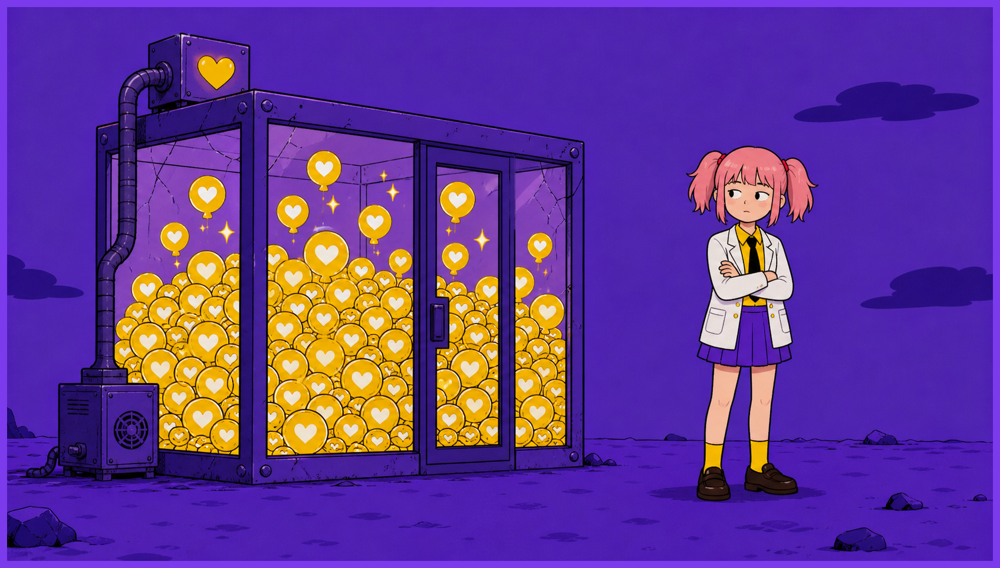
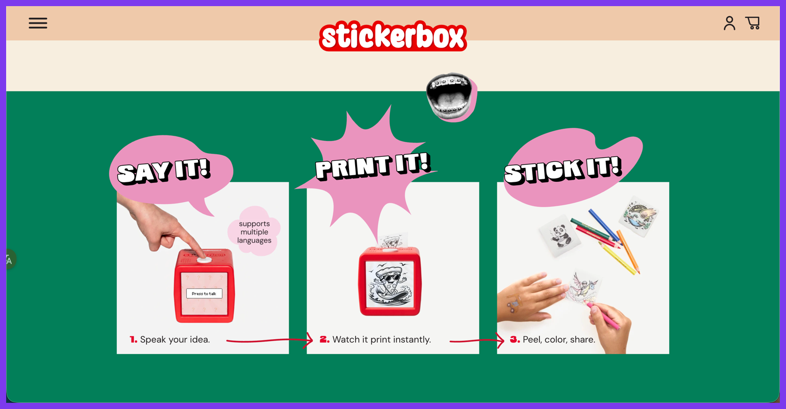
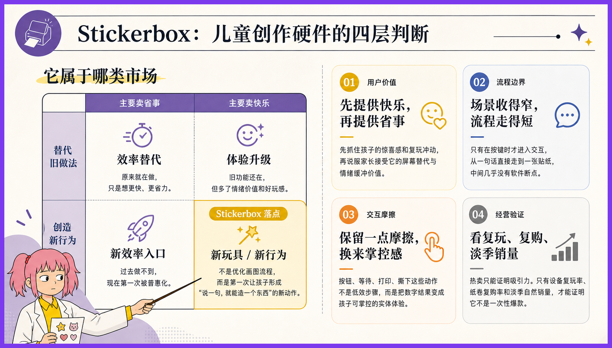
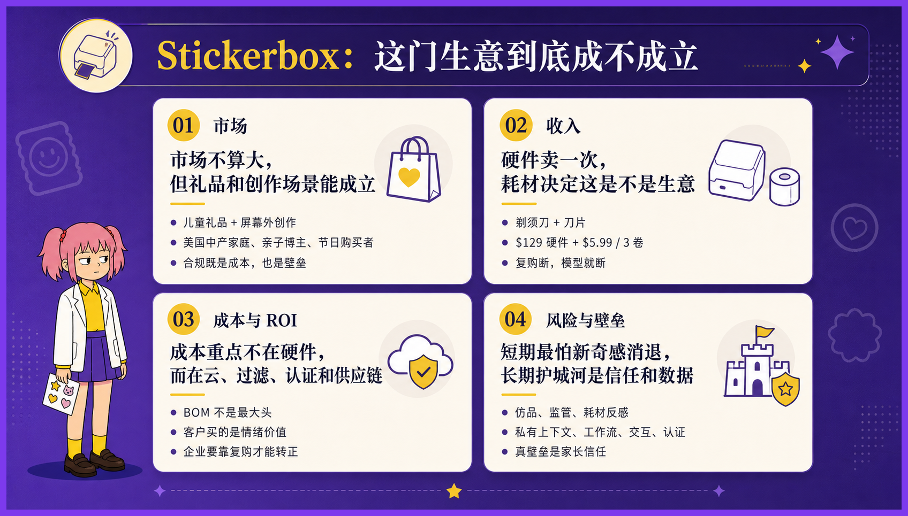
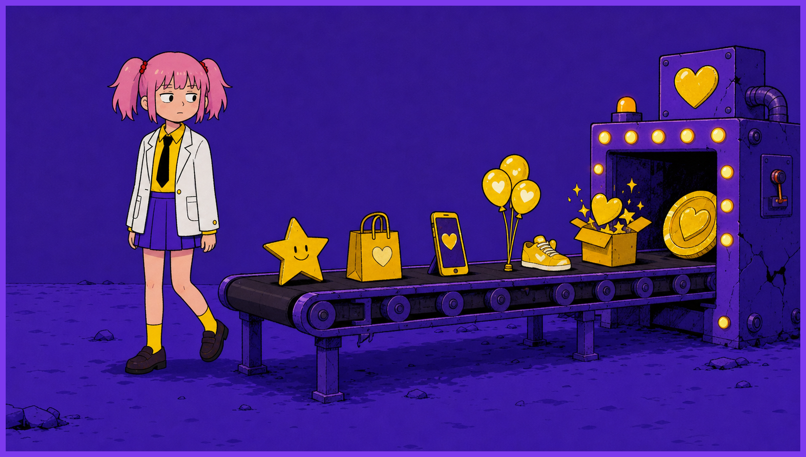

# Stickerbox 教我老板做人

事实如此，不论我信与不信。

AI 硬件这个领域，人人都想做下一代入口。

发布会一个比一个宏大，PPT 上一个比一个震撼领先。创业者站在台上，谈生态、谈闭环、谈All in One，就差说自己其实是钢铁侠了。

**可太平洋对岸，有一个已经赚到钱的AI硬件，只是一个加了AI的贴纸打印机。** 孩子按住大白按钮说"戴太阳镜的恐龙"，五秒后机器吐出一张黑白线稿，孩子涂色、撕下、贴满冰箱。

根据以上事实，无论如何我也不能相信，那些天天喊入口的人，真的懂 AI 硬件。

---

这件事让我前老板很难堪。不过他没意识到，或者他意识到了也不承认。

去年 *(前情提要：AI初创软件公司，坐标京西，去年9月入职)*，老板发动所有人给他想产品方向。那阵子我每天的工作就是看各种 AI 产品，看到眼睛发直。

有一天，一个产品同事兴冲冲和我说，看到一个叫 Stickerbox 的东西特别有意思。孩子说话，它出贴纸，卖得很好。我听完也觉得好。

**用户明确，场景垂直，需求清晰，硬件条件成立，付费意愿充足，持续性差了点**，但不失为一个好产品。

但老板没拍板。

他说，“咱们有可能 AI 硬件，咱们做 AI 硬件不太可能”。

我对 Stickerbox 的印象，就停留在 **"打法很聪明的 AI 硬件产品"。**

---

后来老板似乎下定决心了。

他觉得做 AI 应用软件上限太低，容易被大厂吃掉，要做 AI 硬件，要水涨船高，要活在未来。他让我一个人专门调研AI硬件方向。

这时候，我又想起来阿美莉卡的优先AI硬件产品代表之一，Stickerbox。

举一反三，咱们也可以做这类的产品嘛。

而且这种类型，**对幻觉容忍度高，硬件主要做加法技术成本更低**，适合咱们这种半路出家的人。

我把这些讲给老板听。

老板说，做 AI 玩具没有前途。前几年火，现在不火了。技术价值不高。他要做未来的 AI 入口。

我听了没说话。

---

近几年这种现象特别多。 前有贾维斯引领风骚，后有李维斯、张维斯、大胃袋维斯等后起之秀。

必须要随身携带，精致优雅，无感收集，自动处理，敲一敲能帮你买菜打车点咖啡。

人人都在想将全部的梦想与野心压缩进一个小玩意 _(如，眼镜，戒指，胸针，T蛋，G塞等)_ 里面，不然不配叫 AI 硬件。

可有时候用户愿意掏钱买的，有时候只是一个能解决问题的塑料盒子。

Stickerbox 两周卖完全年库存，Product Hunt 日榜第二，eBay 上加价到三倍。

我老板梦想的 AI 入口，还没见影。这种"没出息"的小盒子，已经把刀乐挣了。

---

最近拜读雄文《置身钉内》，其中说到 **“发心”应该要单纯，不然容易出大娄子** 。我觉得这话送给 AI 硬件创业者也挺合适。

Stickerbox 向我证明，只要回答清楚需求，再简单的场景，也能做出好产品。

我老板大概至今也不信。

他还在等那个能让他"水涨船高"的大机会。

但机会有时候就藏在你看不起的小东西里，**藏在细微的需求里。**

---

上面就是我与 Stickerbox 的故事。谢谢你看完。
