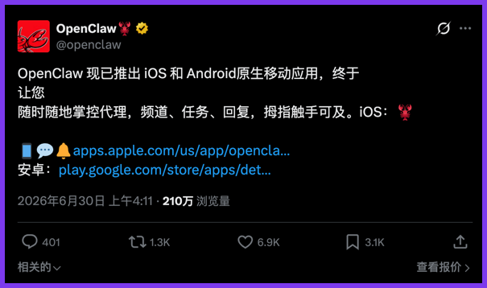
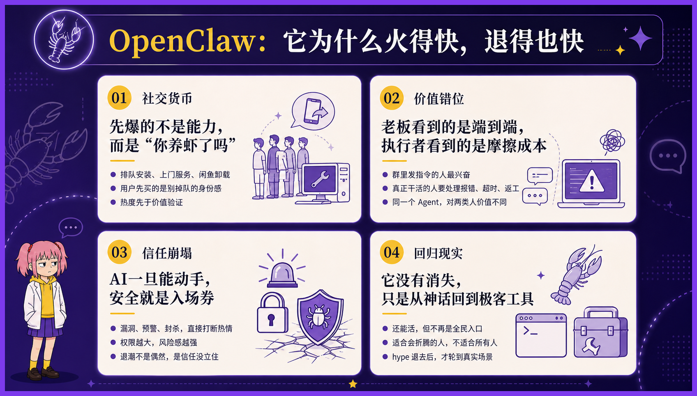
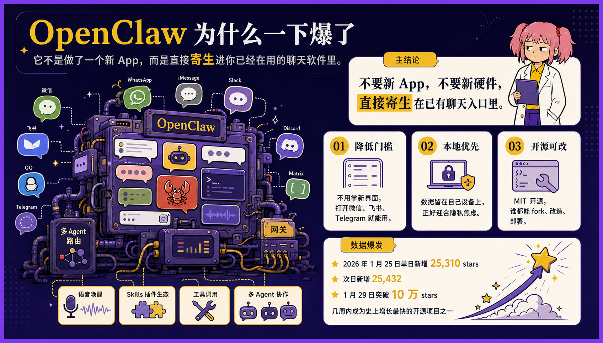
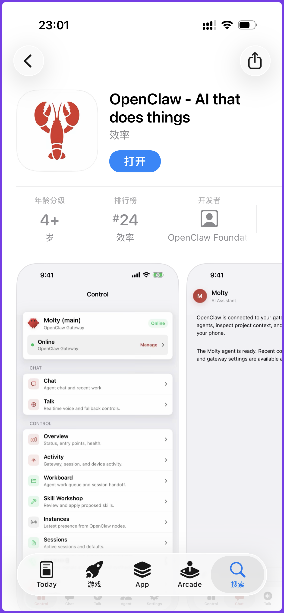
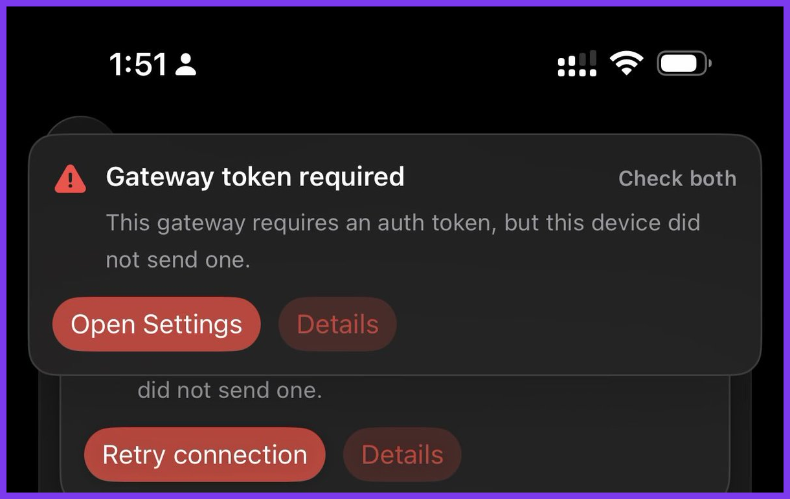
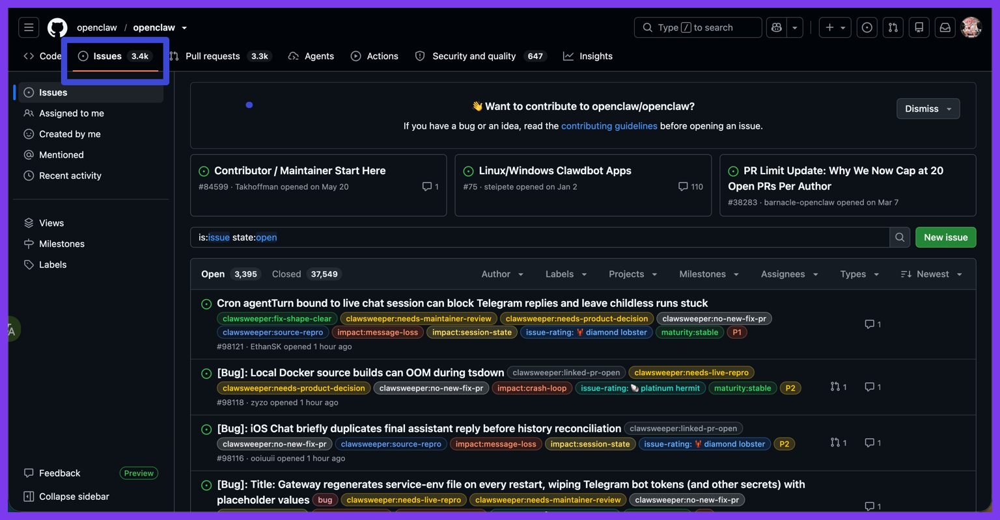
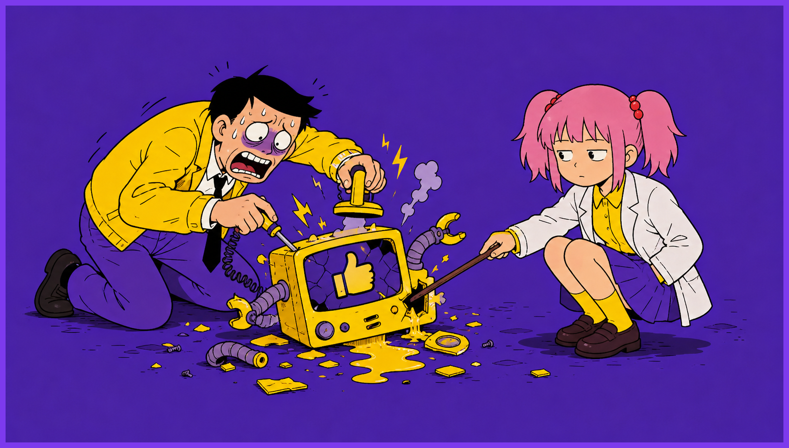

# OpenClaw 移动版来了，牛马终于可以随地大小班

今天 OpenClaw 出了原生 App，iOS 和安卓都能下载。

我看了新闻，第一反是纳闷：这不脱裤子放屁吗？

---

OpenClaw 刚出生那会儿，主打的就是“不要新 App，直接寄生在你已有的聊天软件里”。

微信、飞书、Telegram、WhatsApp，打开就能给电脑上的 Agent 下指令。所以“用手机操纵电脑上的 AI”，从来就不是什么新能力，是它出厂设置的一部分。

那今天 OpenClaw 出个独立 App，变了什么呢？

官方 Slogan 写得极有野心：让智能体运行在你的拇指所及之处。

**换句话说，拇指能触达的地方，都是工位。**

---

OpenClaw 爆火时，我老板是最先反应过来的人。

他搞了一台 Mac mini，在办公室里养起了龙虾。为了接这个机器人，他把公司用了几年的企业微信，整体迁移到了飞书。

从那以后，老板像是终于找到了一位不嫌他话多的下属。白天让它转发，晚上让它整理，到了半夜，再让它把白天总结过的东西换一种方式总结。

龙虾有没有提高生产力，不好说。它至少证明了一件事：**管理者的任务需求，过去并没有被充分释放。**

当然，我们几个干活的产品和技术也有权限 @ 它，只是一直没怎么用。

不是因为和老板客气，**主要是我们手头还有正经工作。**

我也曾怀着敬畏之心测试 OpenClaw ，看它真的用“小龙虾在地上爬的速度”运行，然后报错、然后超时重试。

我没有把正经工作押给它，毕竟我不是老板，我是真的要干活的。我的工作要指望 Claude Code 和 Codex。

后来，我们没有用它，老板也渐渐没那么爱用了。大约两个月后，那只龙虾悄无声息地从群里消失了。

没有通知，没有复盘，也没有人为它举行一场简短而体面的电子葬礼。它曾经一天到晚在群里回复消息，最后停止回复时，反而没有一个人注意到。

这件事说明什么呢？**说明 OpenClaw 对我们这些真正要对结果负责的人来说，并没有带来多少直接的效率提升。**

---

但你要说 OpenClaw 什么都没留下，也不准确。

它至少留下了一种精神。

在它之前，Agent 大多还住在电脑里。你得坐到桌前，打开终端，找到项目，输入命令，多少还像是在正式工作。

**OpenClaw 做的事情，是把这套东西拖进聊天软件。**

这当然是个很聪明的产品思路。

聊天软件本来就是人待得最久的地方。**与其让用户专门跑去找 Agent，不如让 Agent 主动住进用户每天都要打开的窗口里。**

所以 Claude code 和 Codex 之流都陆续跟上了时代的进步。

**谁离用户更近，谁就更容易被使用；谁能让用户少点一步，谁就更有机会留在桌面上。**

---

《人类简史》里有一句违背伟大时代精神的暴论：**“科技的进步，是让更多的人以更糟糕的方式活下去。”**

飞机发明以后，出差的人可以在一万米高空改 PPT；外卖普及以后，人可以不离开工位，也能迅速吃完一顿预制拼好饭。

OpenClaw 未必让 Agent 的结果稳定了多少，却让“随时随地指挥 Agent”变成了一种合理期待。

它让行业看见，原来 Agent 不必等人在工位上召唤，它可以跟着人一起进电梯、进餐厅、进厕所、进被窝。

**后来者当然会继续沿着这条路走。**

因为这是市场竞争最自然的方向：更短的路径、更低的门槛、更强的通知、更即时的反馈。

没有哪家公司会主动说，我们的产品只允许你在工作时间使用；也没有哪个增长团队会把“请下班后不要打开”当成核心卖点。

每一个AI产品经理都可以振振有词：我们只是让用户更方便，我们只是让 Agent 不受设备限制。

没有一个人说自己在延长用户的工作时间。

**AI产品经理们，非常热心地，把最后几个不能工作的场景，一个个消灭掉了。**

**至于那个场景是在会议室，是在凌晨一点的床头，还是在医院的挂号队伍中，并不重要。**

对产品来说，这叫活跃；对企业来说，这叫效率；只有对使用它的人来说，在多年后的某个下午，会突然发现自己失去的是什么。

---

我对 OpenClaw 只有无尽的敬意。

它的开源精神值得尊重，我也真心希望更多优秀的 Agent 产品站出来，狠狠地入那个初生 Anthropic。

**既然时代的车轮你我不可阻挡，我希望 OpenClaw 能更智能一点。**

至少 OpenClaw 能自食其力把自己的 3.4K 个 issues 给改了，再来说接管我的二十四小时吧。

---

以上就是我与 Openclaw 的故事。谢谢你看完。

