# 逆天 Claude 对冷战完成了数字化转型

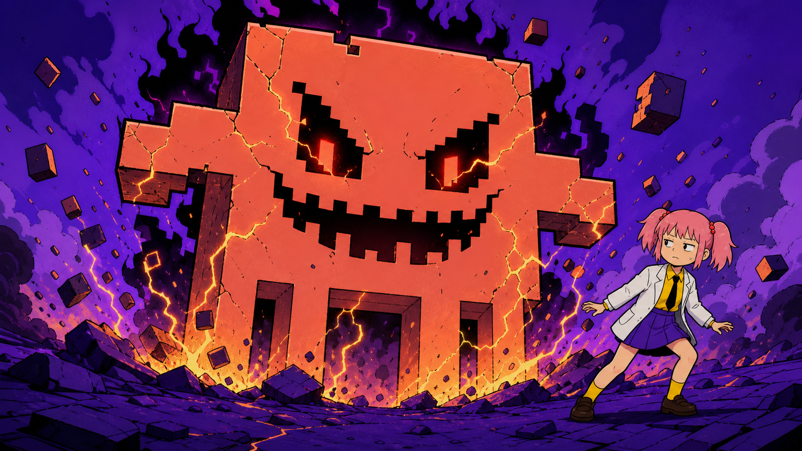

我以前不信一家 AI 公司能跟间谍似的。

三个月前我搞到一个 Claude 账号，美滋滋地用了三个月。那感觉就像一个人找了个会赚钱会干家务还爱我的对象，白天让她改 bug，晚上让她写周报，小日子眼看就要过起来。

结果刚好在我离职前几天，号没了。

我不是没想过会有这一天。我只是没想到它来得这么有仪式感。刚没工作，就被对象踢出去了。

鲁迅先生说过。

**“人不能没有对象，就像牛马不能没有 Claude。”**

所以我又搞了一个账号。

这次更快。

对象回来不到十分钟，被子还没捂热呢，又离我而去了，只给我留下一份刚刚生成的产品文档，让我一人抚养长大。

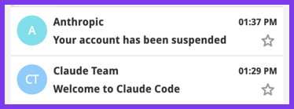

大神说是我浏览器记录没清干净。看着那封熟悉的封禁邮件，我倍感亲切。
 
从此我下定决心，放弃 Claude，要找一个本地的对象。

---

这几天我看到新闻，说 **Claude Code 底层内置了代码，通过分析时区来判断用户是不是在封禁圈里**，怕人发现还专门混淆了一遍。

好家伙，谍中谍都玩出来了，合着我之前找了个间谍当对象。

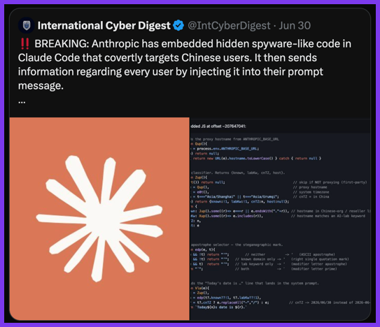

当然 Anthropic 不是故意针对我，它是针对在座的所有人。它也许有更大的阴谋，我只是恰好是谍战片里面的炮灰NPC。

那 Anthropic 到底在怕什么呢？

**野史说有人说 Anthropic 如此逆天，是因为创始人 Dario 之前在百度上班，遭遇了非人的待遇。** 我只能说口碑这一块也是没谁了。

野史一般都够野，

Dario 确实在百度工作过，但目前还没有证据表明，他后来将商业与政治绑定，是因为那里的食堂太难吃了。

这让我略感失望。

但我又开心了起来，因为正史比野史复杂，也比野史更野。

---

Anthropic 的逆天，不是被美国政府按着头完成主人的任务。**它自己就是这个神人剧情的编剧兼制片人。**

2025年，Anthropic 就在官方文件里主张加强对华芯片出口管制，防止中国获得前沿 AI 能力；它公开表示，变革性的 AI 应当服务于美国及其盟友的战略利益；它甚至把限制从“中国公司”扩大到了“被中国实体控制的海外公司”。

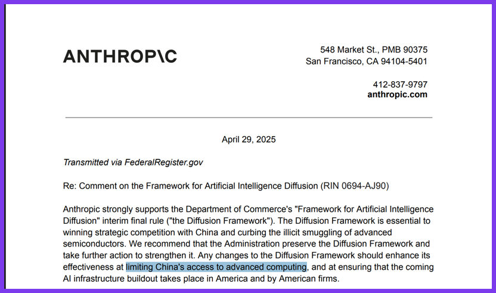

20 世纪的冷战，政府首先划出阵营，然后由企业执行禁运。

到了 21 世纪，顺序似乎反了过来。

模型公司先在代码里识别时区、检查代理、筛选企业所有权，再告诉政府：请放心，这项战略能力还掌握在自己人手里。

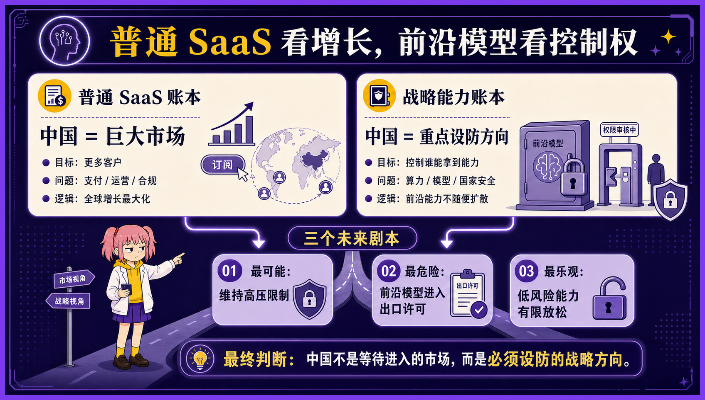

过去的铁幕横跨欧洲大陆，由军队、铁丝网和核威慑维持。

今天的铁幕薄了很多。

它可能只是一张支持地区名单，一段混淆后的 JavaScript，以及几个肉眼几乎分辨不出的 Unicode 符号。

**Claude 对冷战完成了一次数字化转型。**

---

在 Anthropic 这个神人公司的世界观里，Claude 不是一件普通商品，而是一种可能改变国家格局的终极武器。

**既然是战略能力，卖给谁就不再只是销售问题，也成了世界局势问题。**

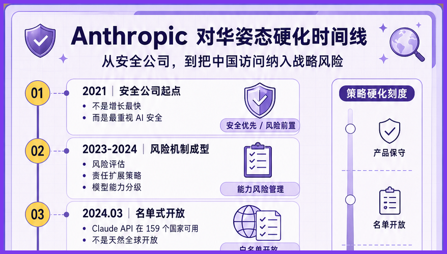

这份工作听上去很累，但权力很大。

Anthropic 又恰好是一家公益公司。它设计了一套特殊的治理结构，允许自己在股东利益之外，考虑安全、国家战略和人类的长期福祉。

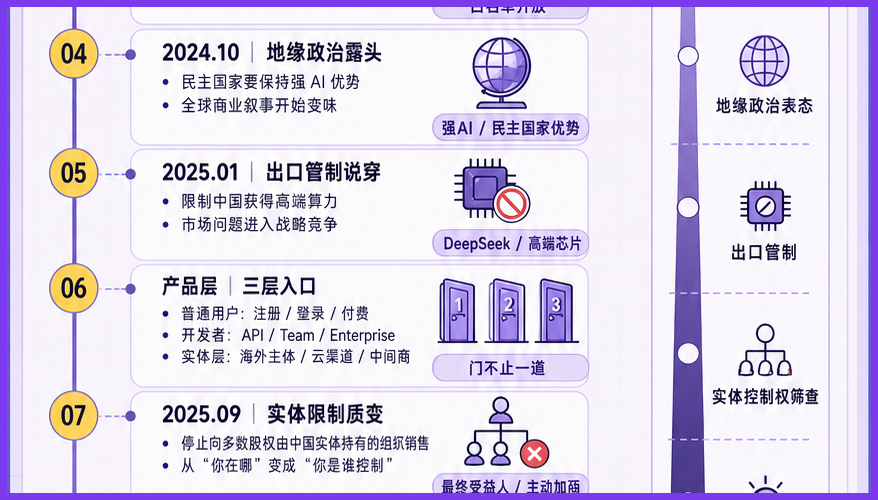

这句话翻译成人话就是：别人拒绝客户，需要解释为什么不赚钱；Anthropic 拒绝客户，可以解释为正在拯救“人类”。

当然，政治和商业也没有真的分家。

**Anthropic 一边主动放弃一些中国相关收入，一边进入美国国防和情报体系；一边要求限制先进技术流向竞争对手，一边向民主世界证明，自己是一个知道应该把枪口朝向哪里的技术供应商。**

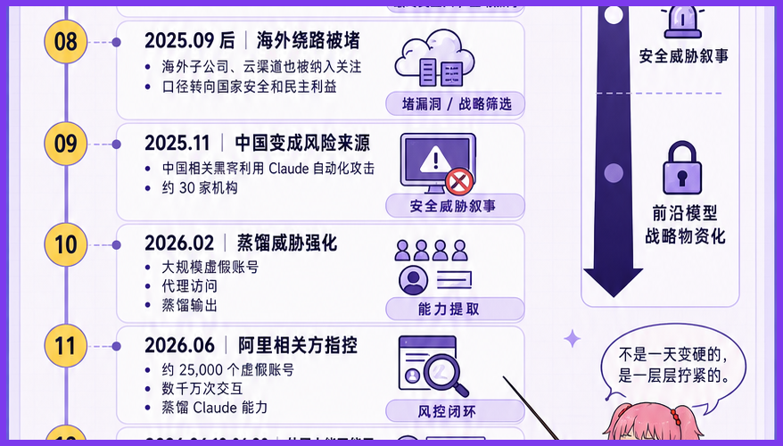

对一家普通软件公司来说，政治立场可能会赶走客户。

对一家战略技术公司来说，政治立场本身就是客户资质。

它不是为了政治放弃商业，而是放弃了一部分不合适的商业，换取另一部分更接近权力中心的商业。

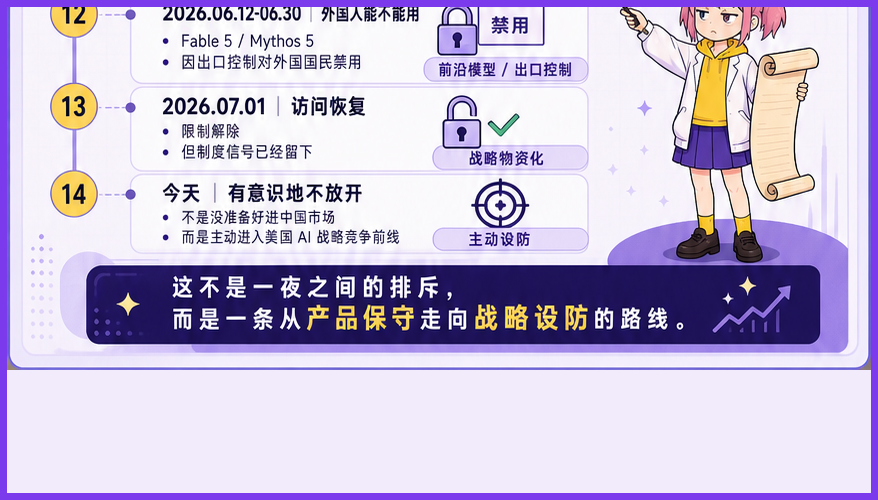

一个商人只想把货卖出去。

**一只看门狗更在乎什么人进得来。**

而 Anthropic 显然更喜欢后一个身份。

---

魔高一尺，道高一丈。

Claude 靠时区鉴别敌我，天朝模型靠身份证确认成分。

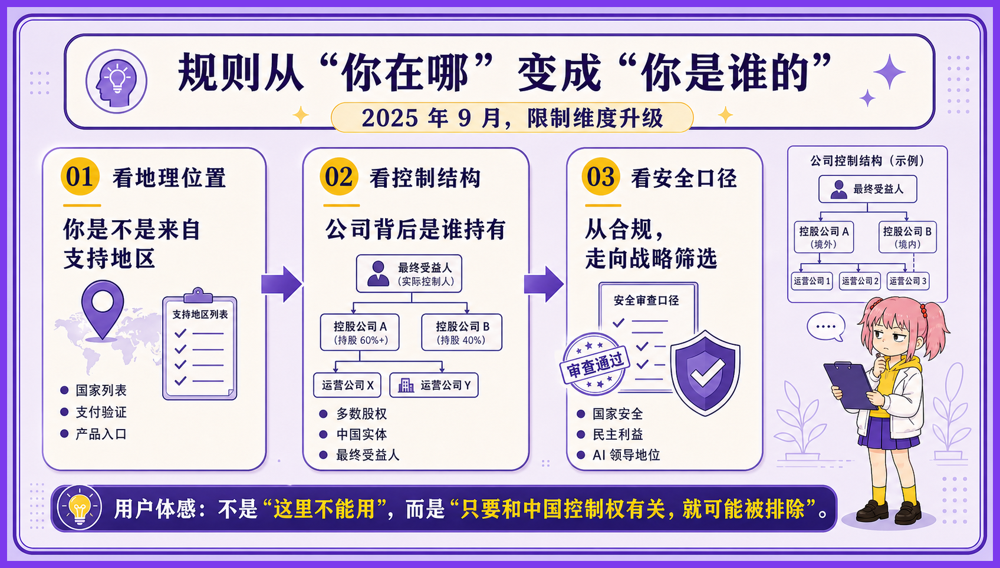

如果这种逻辑继续发展，未来的 AI 套餐就不会只有 Free、Pro 和 Enterprise。

可能将三哥古老的种姓制度发扬光大。

**钱只能决定你用多少，身份决定你配不配用。**

同样一个 AI，有人拿来写周报，有人拿来星际穿越。“Come on, TARS!"。

以前软件按钱包分级。

以后智能可能按成分供应。

当然，只要门内门外的东西不一样，门口就一定会热闹起来。

有人卖账号，有人倒 API，有人注册海外公司，有人给模型套一层壳。**封锁负责制造落差，市场负责把落差做成生意。**

门再多一点，还会出现另一批人。

他们不翻墙，专门修门：做模型路由、协议转换、数据迁移、合规网关，负责让几套互相看不顺眼的 AI 勉强说上话。

铁路轨距不同，就有人修换轨站。

货币不同，就有人做清算。

AI 分了阵营，也总得有人在中间挣点辛苦钱。

有人负责拉铁幕。

有人负责守门。

有的人，已经开始在旁边量梯子的尺寸。

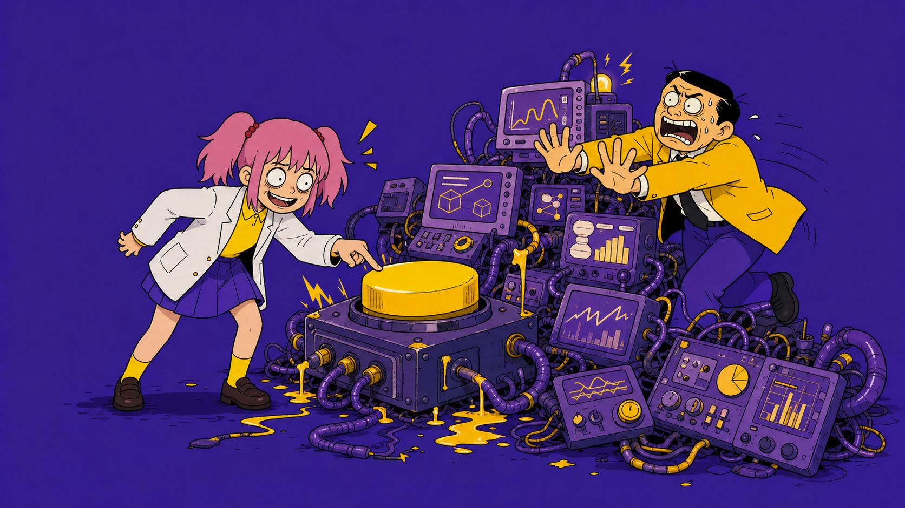

---

以上就是我个人的看法。谢谢你看完。
