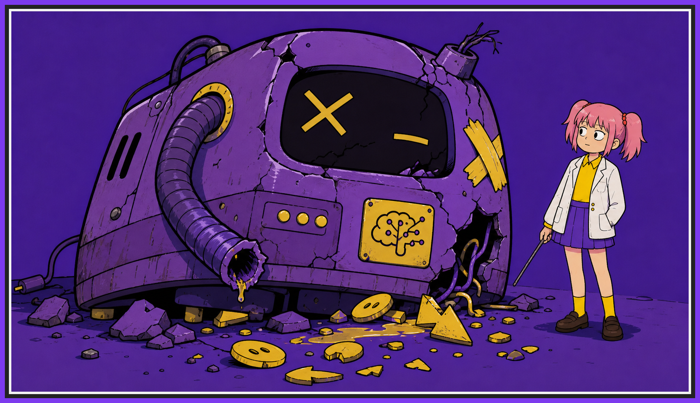
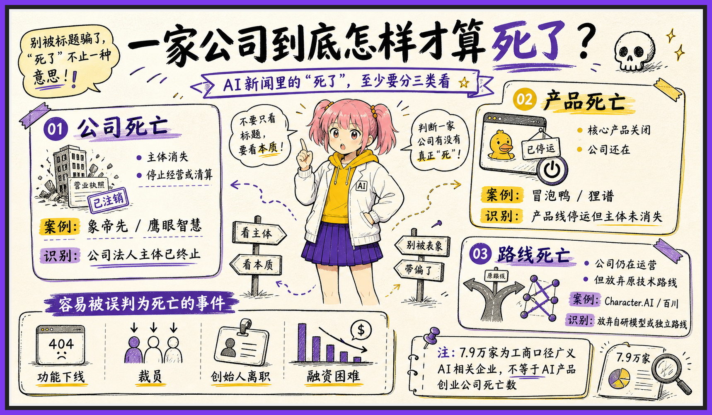
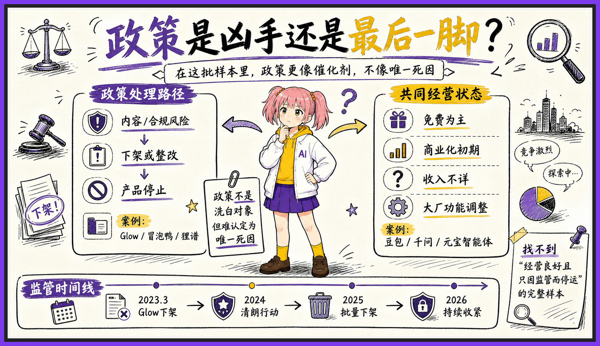
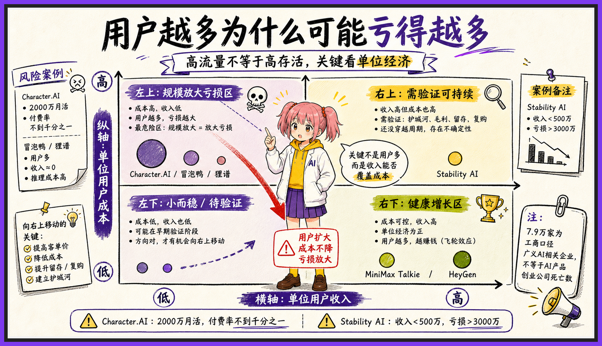
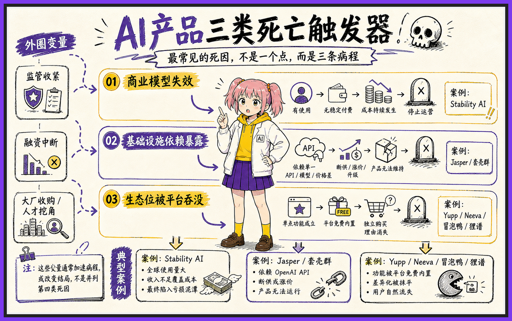
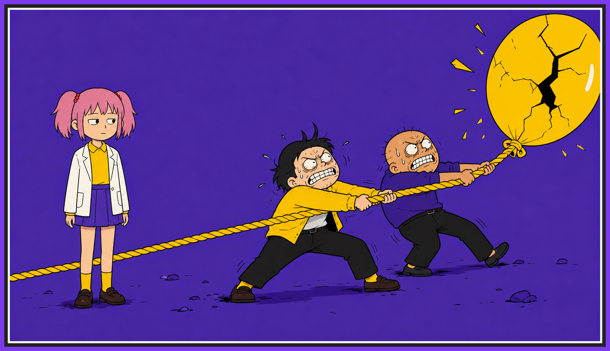

# 我想知道那些 AI 公司是怎么死的

2026 年下半年，我想研究一个很朴素的问题：什么样的 AI 公司能活下来。

这个问题很大，直接研究活人容易被成功学听懂掌声。有位长麻子的县长曾告诉我们，“死人”有时候比“活人”有用。

所以我决定反过来查，过去两年多，哪些 AI 公司已经死了，它们到底死于什么。

## 名单里有活人

Stability AI 欠过债，换过 CEO，核心团队也散过一轮，媒体几次宣传他们被技术核弹爆炸轰得找不着北，但人家官网还开着呢。

Character.AI 更离奇。创始人和一批研究人员去了谷歌，公司不再和大厂硬拼前沿模型，转头经营消费产品。它当然发生了重大变化，但月活仍有两千万量级。把它写成“公司死亡”，多少有点像一个人换了工作，就通知亲友来吃席。

豆包、千问、元宝下架部分拟人化智能体，也不等于公司倒闭。那只是大厂发现某个功能既不挣钱又容易惹事，于是把它关掉。大厂每天都会关掉很多东西，否则公司会像我爷爷多年不收拾的储物间，里面每一件破烂都有一位AI产品经理坚持说以后用得上。

我只好先停下来，研究什么叫死。

公司主体不再经营，可以叫**公司死亡**；公司还在，但核心产品被关掉，可以叫**产品死亡**；公司和产品都活着，只是原来自研模型、独立发展或者宏大使命被放弃，可以叫**路线死亡**。

这三种死法差别很大。

第一种是真的没了。第二种是这个项目没了。第三种则更接近一个年轻人放弃搞摇滚乐，回家考了公务员。你可以说他的理想死了，但最好不要顺便注销他的身份证。

把这几种情况混成一个“AI 公司死亡率”，数字当然会很壮观。

传说 ChatGPT 发布后六百天内，中国有近 7.9 万家 AI 相关企业注销、吊销或停业。这种冲击对于AI这个新时代的婴儿，不亚于一次火星撞地球导致恐龙被压成石油。

当然，里面有多少是真正做 AI 产品的创业公司，有多少只是经营范围里写过“人工智能”，很难说。

## 最像凶手的未必是主因

重新整理完死亡证明以后，我开始查死因。

我最初最怀疑政策。

2023 到 2026 年，中国市场确实有一批 AI 陪伴和角色扮演产品被下架或关停。Glow、冒泡鸭、狸谱、筑梦岛，往下还能列出一串。政策变化离关停时间很近，写成“监管出手，产品暴毙”，多么顺耳。

但如果，暴毙以前，产品就已经没气了呢。

这些产品用户不少，30万上下的DAU，隔壁创业公司的老板都馋哭了。可一到收入、付费率和盈利表现，不足向外人道也。

也许有些公司不是被政策从壮年打死的，而是在病床上碰巧赶上了一次停电。

停电当然可能致命，但病历不能因此只写“死于停电”。

至少在这次整理的样本里，我没有找到一个证据很完整的案例：产品经营健康，用户稳定付费，账也算得过来，最后仅仅因为政策变化，整家公司当场死亡。

这不等于政策不重要。

它只说明“被监管下架”和“被监管杀死”之间，还隔着一张盈利表。不过很多宣传文章为了节省篇幅，把这张表省掉了。

## 更常见的两种死法

最常见的第一种死法其实很朴素，就是账算不过来。

传统互联网有一个深入人心的信仰：用户越多，公司越值钱。很多大厂老兵，出来做 AI 产品，继承了这个信仰。

于是事情变得微妙起来。

一个用户多聊十句话，对普通社区产品来说也许只是服务器多喘两口气；对 AI 产品来说，模型会一个token一个token地跟你算钱。用户越多越活跃，成本越高。如果付费跟不上，增长就不再像增长，更像是负担。

Character.AI 有两千万量级的月活，订阅收入却只来自少量用户。Stability AI 的模型传遍世界，2024 年一季度收入不足五百万美元，亏损却超过三千万美元。至于一些国内陪伴产品，下载量和月活都很好看，收入部分则继续保持神秘。

第二种常见死法，是产品站的位置太薄。

早期很多 AI 产品的价值，来自一个短暂的时间差：大模型已经能做这件事，但大厂还没把入口做好。创业公司做一个漂亮界面，补几个系统提示词，收一笔订阅费，就可以在模型和用户之间搭一张桌子。

问题在于，这张桌子摆在别人家客厅里。

比如 Jasper 是早期 AI 写作的明星，ChatGPT 免费开放后，它原来高价出售的通用生成能力迅速失去稀缺性。2024 年 7 月，OpenAI 又开始阻断来自中国等不支持地区的 API 流量，一批高度依赖单一接口的产品突然发现，自己的核心技术原来是一张别人随时可以停掉的门卡。

Yupp 的故事更干脆。它让用户免费比较数百种模型，评价以后还能获得奖励。后来行业从“哪个聊天模型回答得更好”往 Agent 迁移，需求变了，公司还有钱，却决定停止产品。

底层模型一更新，平台一内置，API 一断，原来很像产品的东西就玩完。

我毁灭你，与你何干。

## 死人只能告诉我哪些姿势危险

把这些案例重新放在一起，我看到的不是一个统一的 AI 坟场，而是三种反复出现的触发器：

商业模型失效，收入追不上成本。

基础设施依赖暴露，上游改一次规则，产品就失去供氧。

原来的位置被平台吞掉，大厂把你的全部功能放进一个免费按钮。

监管、融资中断和大厂收编当然也会改变结局，但它们经常不是单独出现的。很多公司不是被某一颗子弹打死，而是本来就贫血、欠债、站在悬崖边上，最后又碰上大风。

查到这里，我仍然不知道什么样的 AI 公司一定能活。

这让我略感欣慰。假如查一遍死人名单就能得到创业秘诀，墓地应该是世界上最好的商学院。

死亡案例最多只能告诉我，哪些姿势比较危险。

至于出海、硬件、企业工作流是不是正确答案，这些不能由死人证明。得去看另一批公司：它们不但还活着，而且收入是真的，利润不是推测，客户也不是发布会现场临时请来的。

所以这篇调查先停在这里。

有些公司确实死于突如其来的变化。

但大概率不会死于某个宏大的历史时刻。

AI 公司和人差不多。

临终前都喜欢给自己留一点体面。

