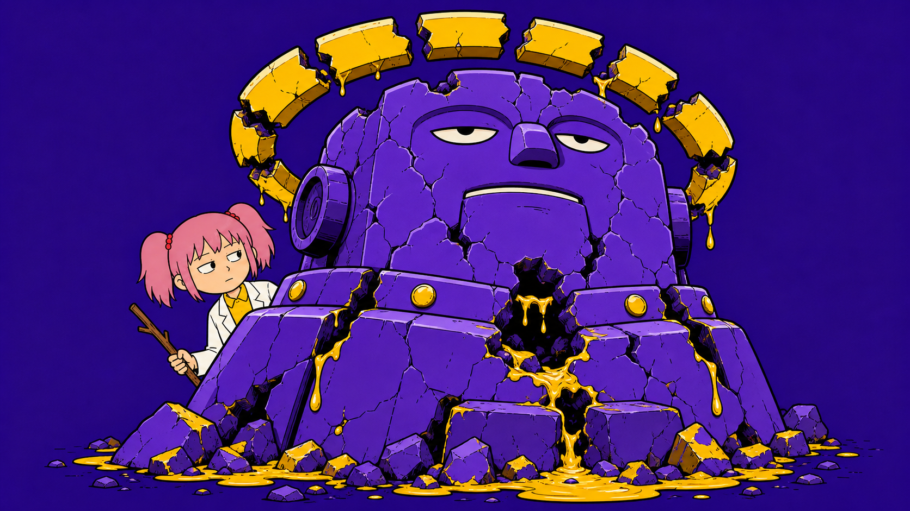
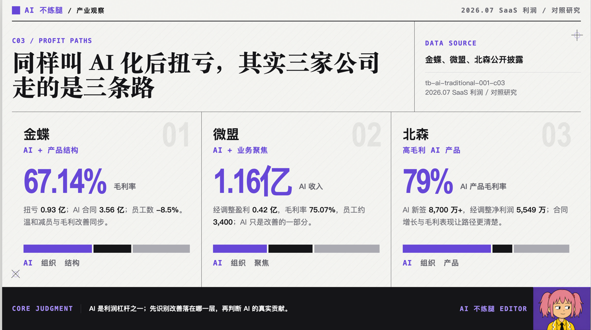
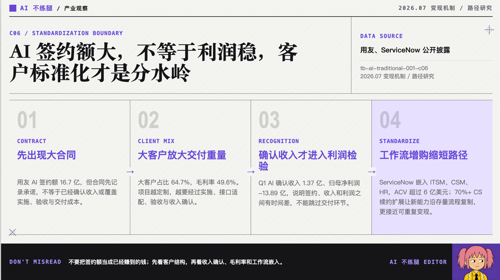
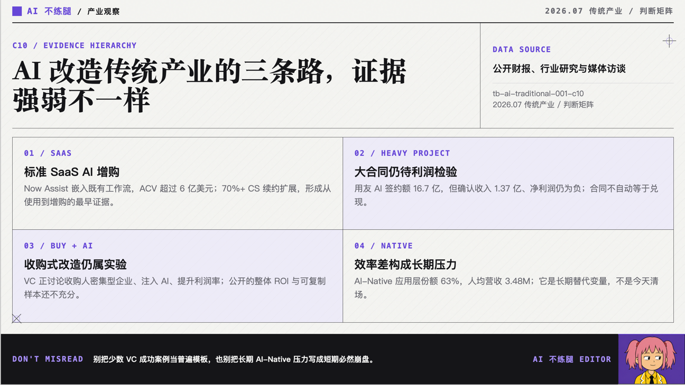
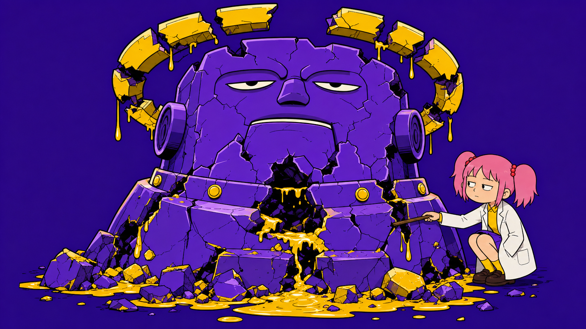

# 传统saas反而先靠AI赚钱了？

我以前相信一件事：AI 来了以后，传统 SaaS 应该最先完蛋。

这个想法很符合进化论。新物种出现，旧物种就该倒在地上，嘴里发出一些含混的叫声。

何况传统 SaaS 长得确实不大先进，页面像财务软件，按钮像电梯控制板，用户一边使用一边问候产品经理全家。

但这几天我看了一些saas公司的披露的财报，发现事情好像恰好相反。

最先从 AI 身上挣到钱的，是这些看起来该被消灭的老家伙。

退一万步讲，逻辑上也能说得过去。

**传统saas已经有客户，有资产，有方法和经验**。AI 塞进去以后，不必创造一个新世界，只要让销售少填两张表，让客服少回复几个重复问题，客户续费的时候就能多收一点钱。

一个技术到底有没有改变世界，很难马上说清楚；它能不能写进报价单里，倒是很快就能得到验证。

这下好了，很多传统公司一看到“AI 化后利润提高”，就坐不住了，觉得我上我也行啊。只要自己积极拥抱AI，那就是强强联合，高水流长遇知音。

殊不知，一番努力之后，发现实际是低山臭水撞雷霆。

背后原因有很多。

**有些公司一边 all in AI，一边裁员，最后利润提高了**。这就像一个博主同时开始跑步、戒酒、失恋和失业，半年后瘦了二十斤，然后宣布减肥秘诀是每天早上喝一杯温水。

利润表很适合制造这种智慧。它把所有原因搅在一起，最后吐出一个数字。数字看起来很科学，至于是谁出的力，它一概不说。

还有一些公司，**AI 签约额十分漂亮，利润却依然难看**。

这也不奇怪。签约发生在酒桌上，交付压力背在加班的工程师身上。会议室里讲的是未来，按照百万为单位消耗的token和生成的屎一样的结果才是现实。

尤其是客户需求复杂、项目周期漫长的公司，AI 不会让交付变轻。相反，它还可能**增加新的实施成本和信任成本**。

当AI在客户现场开始胡言乱语，咕咕嘎嘎，传统的组织是否还能坚持自己拥抱AI的道心，拿出我不入地狱谁入地狱的心态和LLM幻觉斗争，难说得很。

大型组织还是擅长打有准备的仗，和未知的敌人摔跤更适合小团队特种兵们。

AI 从发布会上的卖点，走到利润表上，中间隔着一整条并不便宜的交付链。

现在有钱人有一种新的玩法，收购一批人力密集型企业，往里面灌入 AI，再把利润率提起来。

这个想法很像买下一群骆驼，给它们装上轮子，然后成立一家汽车公司。

理论上不能说不对，毕竟轮子确实比腿快。但在骆驼愿不愿意配合、道路是否平整、司机会不会被踢死这些问题解决以前，最好先不要计算汽车公司的市值。

所以，AI 改造传统行业，最先跑通的并不是最宏大的地方，永远是最靠近打工人的最痛的问题，你能解决他，好处自然是大大滴。

这件事听起来不够振奋，却比较接近事实。

AI 当然可能改变传统行业。只是“加上 AI”和“完成转型”之间，还隔着客户、流程、组织、交付和一张不肯配合宣传口径的利润表。

---

以上就是我对传统saas靠AI盈利的看法。谢谢你看完。