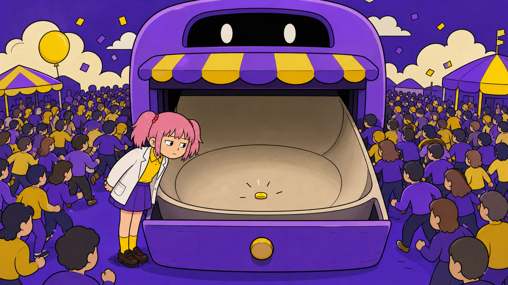
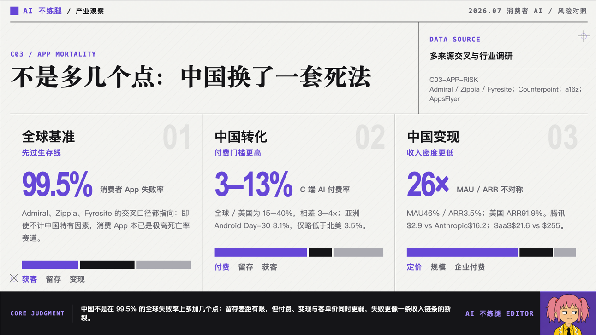
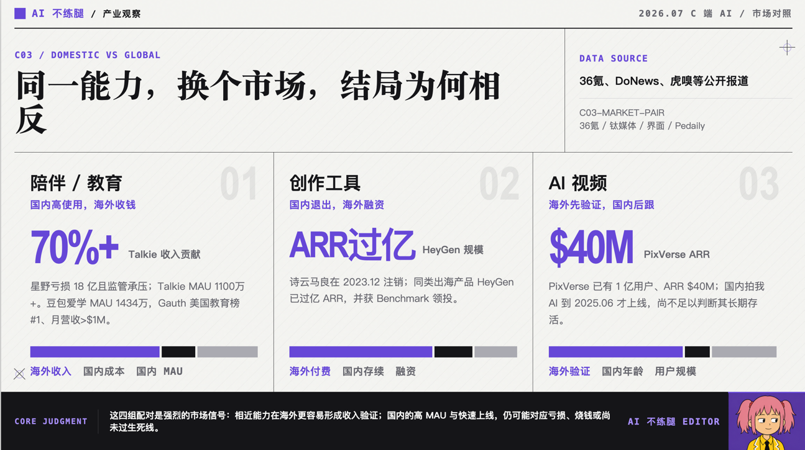

# 国内 C 端 AI：门庭若市，颗粒无收

我之前加入过一家 AIGC 初创公司。

公司想做一个爆款 C 端 AI 应用。

各种原因，我们没做出来。以后有机会，我会把这段经历单独炒一盘回锅肉，这里先不展开。

---

话又说回来，到了 2026 年 7 月，AI 已经进化得很疯狂，行业里讨论的话题也彻底变了。

从 2025 年 Claude Code 对外开放，到 2026 年大家开始讨论 Skill、Harness、Loop Engineering，行业的注意力正从“做一个能聊天、能画图、能生成内容的 AI 应用”，转向“怎么让 AI 真正完成复杂工作”。

AI 不再只是上台表演才艺。

但在这个时候，我反而冒出一个很好奇的问题。

**从 2024 年开始爆火的那批 C 端 AI 应用，现在到底怎么样了？**

反正我每天看的 AI 日报都在告诉我，AI 行业每天至少有一颗核弹爆炸，日抛型 SOTA 模型层出不穷。

那批原来做 C 端 AI 应用的公司，是已经被这场疯狂的技术进化轰炸成了渣，还是吸收了 AI 核辐射，进化成了强大的火星蟑螂？

我的体感是，到现在为止，仍然没有看到一个真正意义上的国内爆款 C 端 AI 应用。

当然，也可能不是它们没有成功。

也可能是在我看不到的地方，一群创业者早就看清了未来：像我这样的国内垂类用户，消费能力不强，意见还特别多，根本不值得服务。

于是他们非常理性地忽略了我，顺手帮我制造了一个信息茧房。

---

基于这种体感，我一开始想下一个很不负责任的暴论。

做国内市场的 C 端 AI 初创产品，死亡率高达 100%。

后来觉得这样说不够严谨，于是重新调研了 110 个从 2024 年至今出现的 AI 产品。

调研完成后，我很高兴地告诉各位创业者。

**国内娱乐类 AI 产品的死亡率没有达到 100%，大概只有 90% 到 95%。**

作为参考，全球消费者App失败率约99.5%。

所以真相可能是，还有很多挂掉的 AI 产品没有被我调研到。

或者，消费级 AI 产品的表现超出预期，狠狠打了我的脸。

---

调研分析显示，AI 陪伴和 AIGC 社区的死亡率接近 100%。

有兴趣挑战自己、挑战统计学极限的朋友，可以优先考虑这两个方向。

相比之下，**在我的调研样本中，C 端工具类 AI 产品的存活率大概在 38% 到 50%。**

听上去还不错。

但很多产品也只是维持着生物学意义上的存活。

至于活得是否体面，就不太好说了，像我一样。

---

看完这 110 个产品后，我发现国内 C 端 AI 创业最后大概只剩三条路。

**小、跑、死。**

第一条路：小

“小”不是先做一个小产品，等验证成功后再慢慢长大。

而是从一开始，就把它当成一门小生意。

团队控制在一到两个人，比如两口子关起门来搞产品。月成本低于 5 万元，开发、运营、客服、设计、推广最好全由同一个人完成。

一个人既当 CEO，也当产品经理和程序员。晚上服务器挂了，还得自己从床上爬起来修。

比如 Podwise，两人团队，早期两个月做到 1.44 万美元 ARR。

ThinkAny 是独立开发者项目，没有融资。

这类产品共同的特点，是不追求大规模增长，不建立庞大团队，也不花几千万元请何老师拍广告，再把广告塞进电梯里。

只要有一千个稳定付费用户，就能养活整个团队，属于一人吃饱全家不饿。

当然严格来说，这很难算传统意义上的“创业公司存活”。

它更像是一个 freelancer 用软件养活了自己。

---

第二条路：跑

“跑”的意思，是跑出去。

更准确一点，是跑去赚资本主义的钱。

不得不说，万恶的资本主义，确实把那帮老外的消费习惯惯得非常刁钻。

我以前看《老友记》，Joey 吃炸鸡只吃外面的皮，里面的肉全扔掉。

这种行为要是出现在中国家庭里，不但鸡腿保不住，Joey 自己的腿可能也保不住。

但这种消费习惯背后，对应着一个很现实的问题。

歪果仁有更好的消费习惯，属于我今天不花出去一百块就睡不着。

同样一个 AI 产品，放在国内，像我这样的低质量用户会先去B站搜白嫖教程。

放到海外，用户虽然也会嫌贵，但至少愿意掏出信用卡试一下。

Counterpoint Research 2026 年第一季度和 a16z 等机构的报告，都指向一个很夸张的不对称现象。

**全球 AI 产品的 MAU 中，有很大一部分来自美国之外的市场；但 AI 产品绝大部分 ARR，仍然集中在美国。**

中国及相关市场贡献了大约 46% 的 AI MAU，却只贡献了约 3.5% 的 ARR；美国则贡献了约 91.9% 的 ARR。

翻译成人话，全村的人都在你家店里吃饭，看起来门庭若市，吃完之后却没几个人付钱。

**同一个产品，国内版和海外版的命运有时候差异非常夸张。**

MiniMax 的 AI 陪伴产品，国内做星野，海外做 Talkie。

星野面临亏损和监管压力，Talkie 则拥有千万级月活，并贡献了公司大量收入。

诗云科技的国内产品诗云马良最终注销，海外方向却长出了 HeyGen，后来成了 AI 视频领域的代表公司。

爱诗科技也是先在海外用 PixVerse 验证，做到上亿用户和数千万美元 ARR，之后才重新回到国内推出拍我 AI。

这几组案例最有意思的地方，是它们近似构成了一个对照实验。

产品方向差不多，团队能力差不多，底层模型能力也差不多。

只改变一个变量。

市场从国内换到海外。

产品的命运就完全不一样了。

所以很多时候，不是 C 端 AI 产品没有价值。

而是中国的 C 端付费市场，没办法支撑它按一家典型创业公司的成本结构活下去。

---

第三条路：死

最后一种结果，就是死。

有一些创始人比较幸运，见好就收。

产品做出一定用户量后，卖给大厂，拿钱离场，从此财富自由，去云南种蔬菜。

有一些公司选择转型。

原来做 AI 社区，后来改做企业服务；原来做 AI 陪伴，后来改做 Agent；原来要改变全球十亿人的生活，后来开始给企业卖知识库。

还有一些公司继续融资。

既然已经走到这里，不如和投资人一起赌上未来。只要下一轮融资能进来，今天的问题就留给明天解决。

但如果一个产品同时满足下面几个条件。

团队很大、成本很高、只做国内市场、没有稳定付费、用户留存一般，还要持续消耗大量 Token。

那基本就属于天崩开局。

天无绝人之路，但创业者自己买了水泥，连夜修了一条路，再亲手把出口封死。

相信二十年之后，当人类真正进入 AGI 时代，我们会记得这些创业者英勇的牺牲与奉献。

---

为什么国内 C 端 AI 创业这么难。

全球消费者 App 的失败率，本来就很高。

一些行业统计甚至把失败率估计在 99% 以上。

所以，C 端创业从来都不容易。

中国市场又在这个困难模式上，额外叠加了几个 Buff。

付费率低，ARPU 低，AI 产品的边际成本还这么高，还有神秘力量变幻莫测。

朱啸虎曾公开表达过一个很有争议的观点，“很多 AI 应用只是套壳，所谓壁垒是在忽悠人。”

但他同时也说过，“过去十年，全球超过百亿美元估值的 C 端 App，很多都是中国创业者做出来的。”

把这两句话放在一起看，其实很有意思。

中国创业者并不是不会做 C 端产品。

恰恰相反，过去十几年里，**中国团队在移动互联网时代证明了很强的产品能力、增长能力和运营能力。**

问题是，从 2022 年底 ChatGPT 问世之后，很多互联网老兵重新出来创业，带来的仍是上一轮互联网的作战地图。

这一套方法在移动互联网时代非常有效。

因为当用户规模足够大，即使用户不直接付费，也可以通过广告、电商、游戏、增值服务等方式慢慢变现。

但 AI 产品的逻辑变了。

一个 AI 产品如果没有真正解决问题，用户不会因为里面多了一个广场和关注按钮，就突发恶疾要掏钱给你。

很多产品看起来用户很多，社区很热闹，却既没有解决高价值问题，也没有形成高频刚需，更没有建立稳定的付费习惯。

建议还是学习峰哥，拿投资人的钱去反手去买点光模块。

---

国内 C 端 AI 还能不能做，更现实的路径可能只有三种。

第一，把公司做得足够小。

不要先证明自己能不能成为独角兽，先证明一千个用户能不能把团队养活。

第二，从第一天就做全球市场。

不要等国内验证失败后，再把产品翻译成英文。

第三，真正解决一个高价值问题。

C 端工具真正有机会的地方，不是功能更多，而是离最终成果更近。

用户不是想要一个 AI 视频生成器。

他想要一条今天晚上就能发出去、还能带来播放量的视频。

用户不是想要一个 AI 写作助手。

他想要一篇能够发布、不会被老板骂、最好还能带来转化的文章。

AI 产品与用户真正需求之间，往往隔着十万八千里。

谁能把这段距离缩短，谁才有机会活下来。

---

以上就是我个人对AI C端 初创产品的看法。谢谢你看完。
