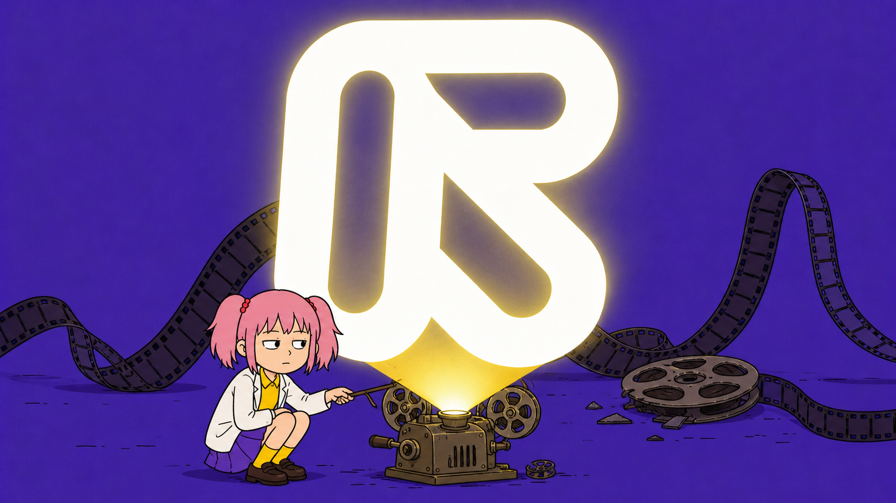
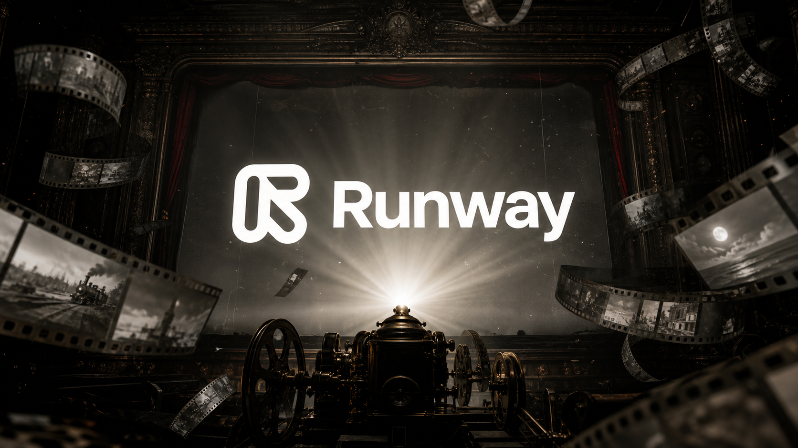
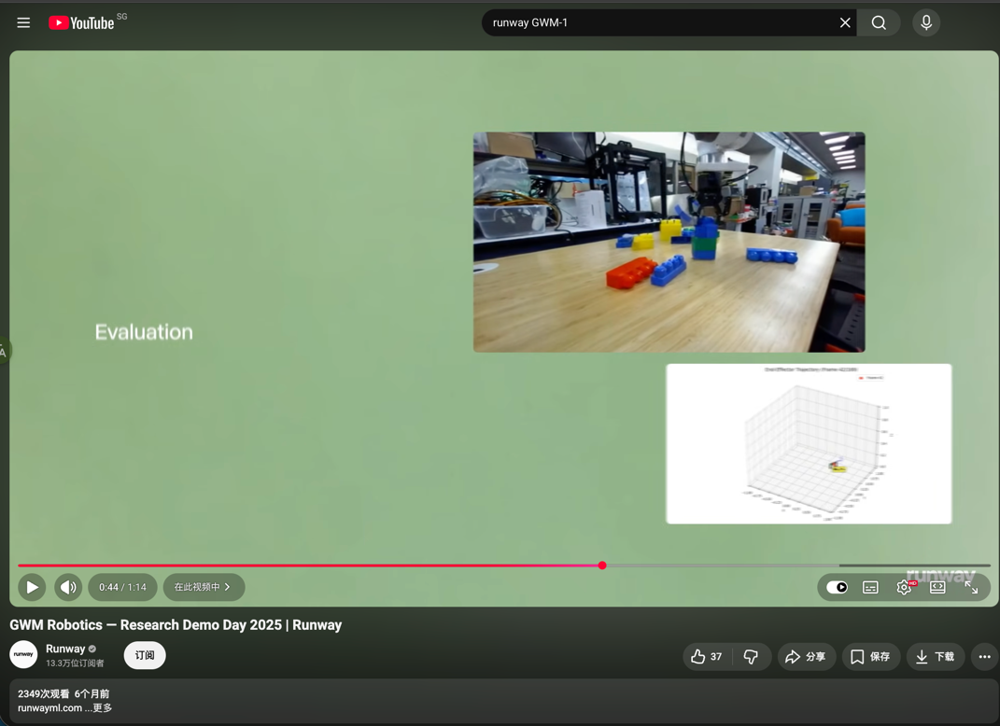
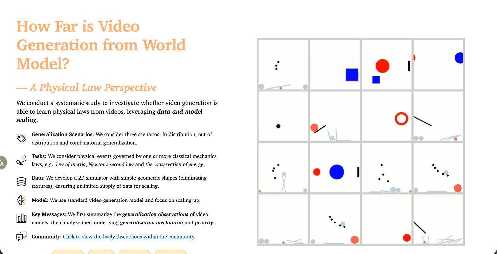
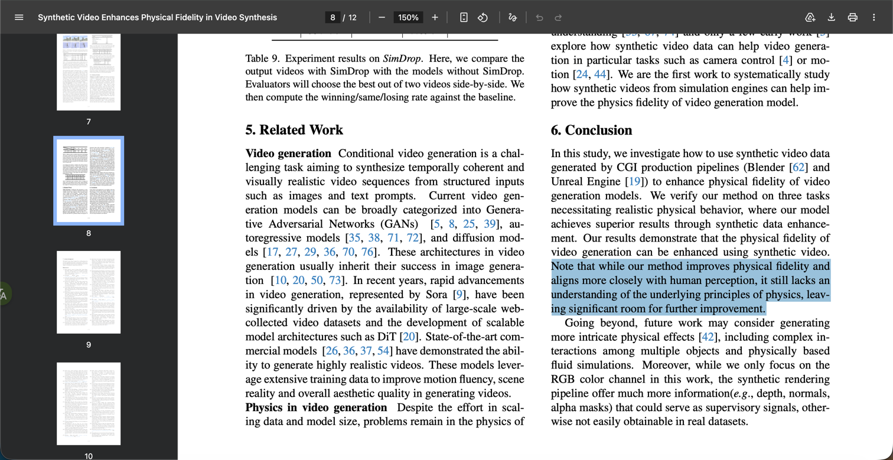
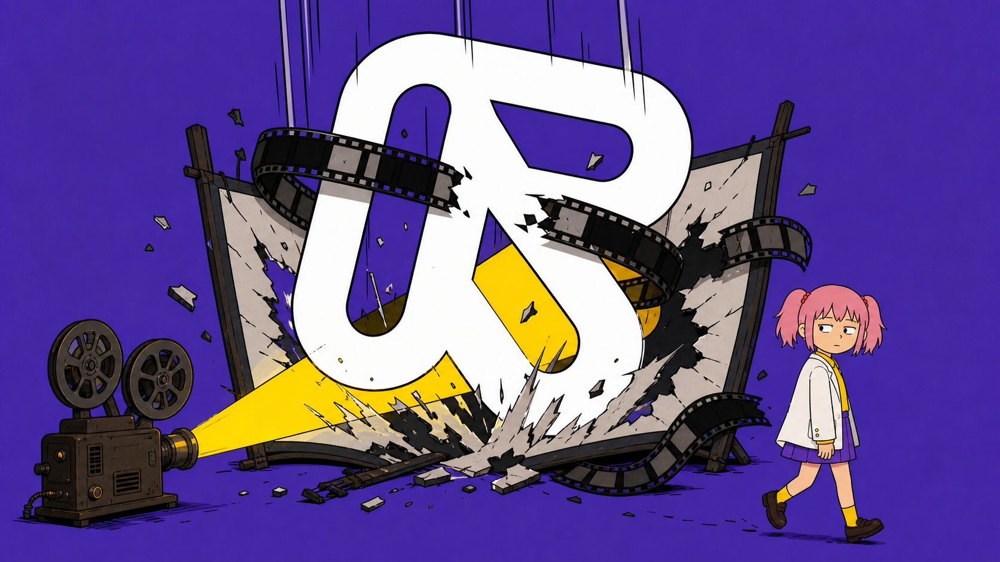

# 人类发明电影的那一天，Runway 输麻了

在上一家公司时，我们曾用 Runway 复刻一段视频。

当时能输入参考视频的模型不多，Runway 算少数。于是我充了点钱，准备见识一下硅谷先进生产力。

结果它确实提高了效率。

以前要花几个小时，才能做出一条让人失望的视频；用了 Runway，只需几分钟，就让全办公室乐了出来。 

所以后来看到 Runway 说自己不仅能生成电影，还能还原宇宙，当它估值达到 53 亿美元的时候，我一度怀疑这个世界是不是坏掉了。

但再想了一下，我发现真正坏掉的可能不是这个世界。

而是我们理解 Runway 的方式。

也许人家一开始的梦想就不是打算生成电影。

**假如人类从来没有发明过电影，Runway 的估值会不会反而更高？**

## 我要创造一个没有电影的世界

在那个世界里，没有好莱坞，没有短剧，也没人以为走个面儿受到伤害。

然后有一天，Runway 炸裂出世。

人类第一次看电影，真的以为自己会被荧幕里面的火车创飞。

人类第一次看到 Runway，也应该坚信它真的创作了一个世界出来。

大家会问，它能不能模拟台风？能不能推演交通？能不能预演一场还没发生的战争？

第一个找上门的客户也许不是导演，而是军队。参谋长用它把战争模拟一千四百万遍，然后 cos 奇异博士，向将军比出一根食指。

**在这样的世界里，Runway 不会被归类为创意软件，而是一家现实推演公司。53 亿美元估值不仅不高，甚至显得人类缺乏想象力。**

## 一个视频生成工具，为什么值 53 亿美元？

**2026 年 2 月，Runway 完成了 3.15 亿美元的 Series E 融资，估值达到 53 亿美元。**

投资人名单包括但不限于 General Atlantic、NVIDIA、Adobe Ventures、AMD Ventures、Fidelity、Felicis。

基本上从做芯片的、做软件的到管钱的可以说都上桌了。

但 Runway 这家伙最精了，人家才不会透露自己的营收情况。

有机构估计，Runway 2024 年确认收入只有四千多万美元，年末 ARR 大约七千万美元。

还有更乐观的说法，直接把数字估到了两亿多美元。

大家连它到底赚了多少钱都没有完全搞清楚，却已经一致认为它值 53 亿美元。

**假设 Runway 一年收入一亿美元，53 亿对应的是五十多倍收入。**

如果它只是在销售视频生成订阅和积分，那么投资人表现出的热情，就像有人准备花钱卖浣熊当宠物，结果买到了小浣熊干脆面。

## Runway 的估值，是跟着“世界模型”一起长大的

2023 年 6 月，Runway 完成 Series C extension 时，投后估值大约 15 亿美元。

那时它还没有 Gen-3，收入据第三方估算也只有数千万美元。

2024 年 6 月，Gen-3 Alpha 发布，Runway 开始明确把产品和 General World Models 挂钩。

到了 2025 年 4 月 Series D，估值涨到约 30 亿美元。

CEO 开始公开表示，要“以世界模拟器构建新媒介生态系统”。

2026 年 2 月 Series E，估值又跳到 53 亿美元。

这一轮融资公告的主题，已经直接变成了。

塑造世界模拟的未来。

**Runway 的估值几乎是跟着它从“视频生成”走向“世界模拟”的叙事同步上涨的。**

反正 Runway 对自己的解释差不多就是这样。

视频生成只是开胃菜。

**模型为了预测下一帧，就必须慢慢学习世界如何运行。**

同样的逻辑，如果我把机场的成功学书全部看一遍，我离走上人生巅峰迎娶白富美就不远了。

## 视频模型，真的会自然长成世界模型吗？

问题是，会拍世界，不等于理解世界。

ICML 2025 的相关研究专门测试了视频模型对物理规律的理解。**模型可以把画面做得越来越逼真，但视觉效果的提升，并没有自动带来物理理解能力的同步提升。**

T2VPhysBench 测试了重力、碰撞、能量守恒等12类物理规律，所有被测模型在每类规律上的平均得分都低于0.60。即使把物理规则直接写进提示词，模型仍会违反它们。 

李飞飞把更远的目标称为“空间智能”：AI 不只是生成画面，还要理解、创造并与三维世界交互。她也明确承认，真正服务机器人和科学的世界模型仍缺少关键的动作数据和可靠模拟能力。 

Runway 要完成的可不是普通升级，而是一次物种跃迁。

## 投资人买的不是公司，而是一张彩票

Runway 的估值，可能本来就不应该用传统现金流折现来理解。

**它更像一张看涨期权。**

投资人当然知道，Runway 今天的主要收入来自视频订阅、积分和企业合同。

但如果 Runway 真能从视频生成跨越到现实模拟，它面对的就不再只是几十亿、几百亿美元的创意软件市场。

成功概率可以很低。但一旦成功，回报足够大。

**买了不一定赢。不买，真的会输。**

## 人类发明电影的那一天，Runway 输麻了

回到最开始那个脑洞。

假如世界上从来没有电影，Runway 可能更容易被理解为一家世界模拟公司。

但现实中，电影已经存在了一百多年。

所以 Runway 必须先向所有人证明，它生成的不只是画面，而是赛博牛顿。

如果它最终 Runway 渡劫失败了，那么这 53 亿美元，就会成为人类历史上最昂贵的一张电影票。

或者也有一种可能，这些视频生成公司本身就在把自己拍成一部电影。

至于最后拍出来的是《星际穿越》，还是《上海堡垒》，谁知道呢。

**而咱们有幸坐在第一排，看完这场史诗大戏。**

这么一想，我这辈子简直是赚麻了。

---

以上就是我个人关于 Runway 与电影的奇思妙想，不构成投资建议。谢谢你看完。
