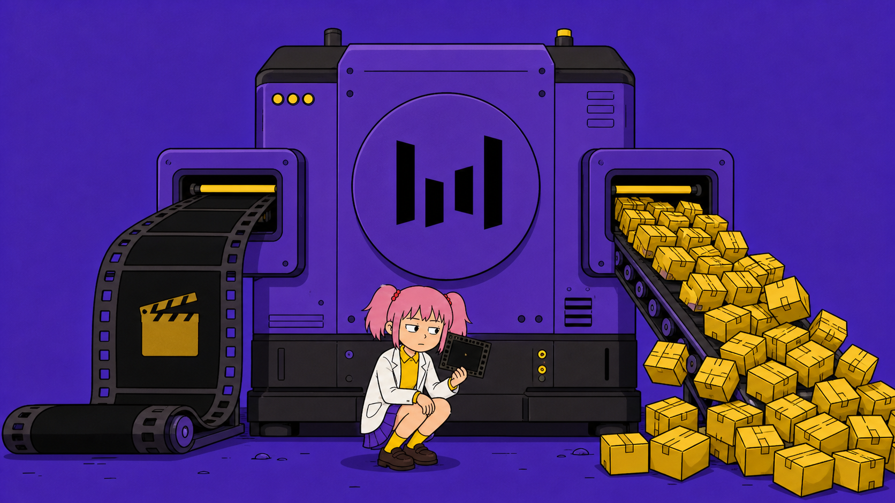
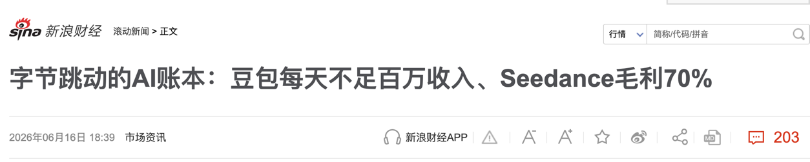
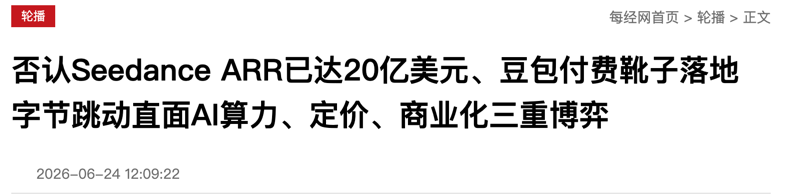
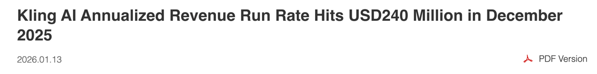
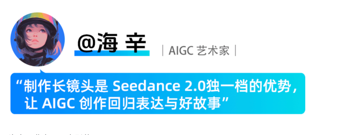
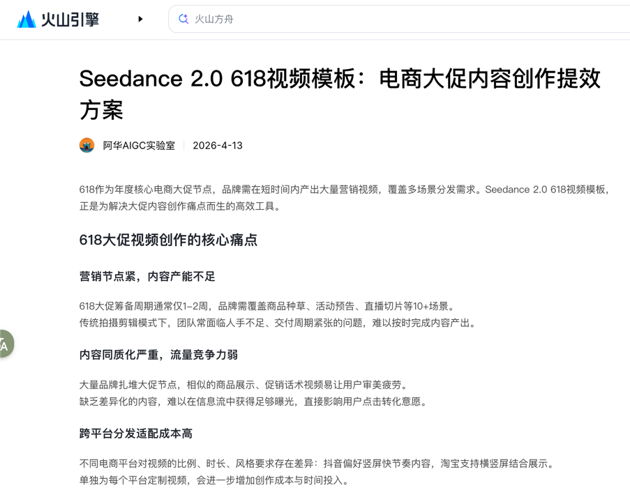
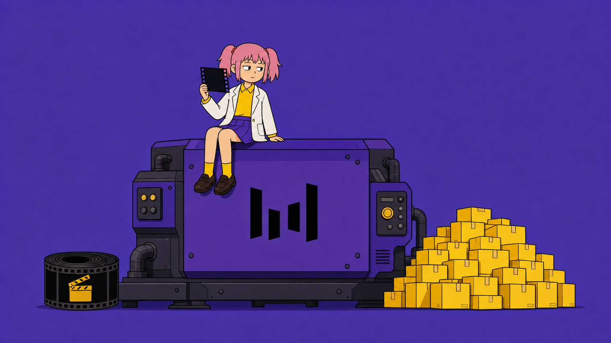

# Seedance B 端分化，短剧买稳定，电商买产量

Seedance 被多家媒体称为 AI 视频商业化样本。

2026 年 6 月，LatePost 报道称 **Seedance 单月超过 10 亿元，年化收入约 20 亿美元。**

同文还称，Seedance 每 10 元 API 收入中约 3 元为服务器和推理成本。

火山引擎总裁谭待在 2026 年 6 月的 FORCE 大会上回应称，外界流传的收入数字"都是错的，而且偏高"。

谭待没有披露替代数字。

这些报道和回应共同说明，Seedance 的商业化信号已被市场高度关注，即使具体财务数字仍无法被公开核验。

与此相对照，快手在 2026 年 1 月官方披露。可灵单月超过 2000 万美元，年化收入 2.4 亿美元，服务超过 6000 万创作者和逾 3 万企业客户。

**AIGC 视频生成已经存在规模化的 B 端付费需求。**

---

但"存在付费需求"不等于"所有 B 端客户买的是同一种价值"。

火山引擎官方案例页记录了一位创作者的对比。过去一个 2 秒镜头可能要一天、上百次尝试和约 2000 元成本。使用 Seedance 2.0 后，15 秒长镜头平均约三次尝试。

同一页面还列出 42 秒一镜到底的案例。

这种反馈指向的痛点，**是跨镜头角色漂移、镜头之间无法连起来、声音和口型需要另行处理。**

2025 年 12 月，Seedance 1.5 Pro 发布，核心变化是原生音画联合生成，支持多语言和方言口型、运镜与叙事连贯性。

官方把影视、短剧、广告、动画列为目标场景。

2026 年 2 月，Seedance 2.0 发布，核心能力是可输入文本、图像、音频和视频，最多支持 9 张图、3 条视频和 3 条音频作为参考。

这些能力直接对应"已有商品图、角色资产、品牌音乐和镜头素材的可控变体"需求。

火山引擎后续发布的 618 营销和电商内容案例文章中，案例提供方称广告和电商团队用商品图、品牌素材、脚本和音乐快速做多个镜头方向。

这指向另一种需求。**不是让单条视频更完美，而是让同一资产快速产生更多可测试版本。**

---

这两种需求的产品指标不同。

短剧/影视团队更关心生成一致性、人工返工率和镜头之间的连贯性。

广告/电商团队更关心素材产出量、测试密度和从生成到投放的周期。

**这两大类客户都在 B 端市场，但付费驱动力不完全相同。**

如果产品只强调一致性，电商客户会觉得不够快。

如果产品只强调批量，短剧客户会觉得不够稳。

这个区别意味着，**AI 视频 B 端市场存在至少两个大垂直分类，给很多 AI 视频应用提供了喘息的空间。**

当然这肯定是不足以支撑产品定位的。

创业圈常有一种说法。找场景至少要连续垂直三次，从行业缩到客户，再缩到一个可验收的具体任务。

你做的产品，你服务的是哪一种？

---

AI不练腿，保持好奇，保持真实。祝你牛逼，也谢谢你看到这里。

