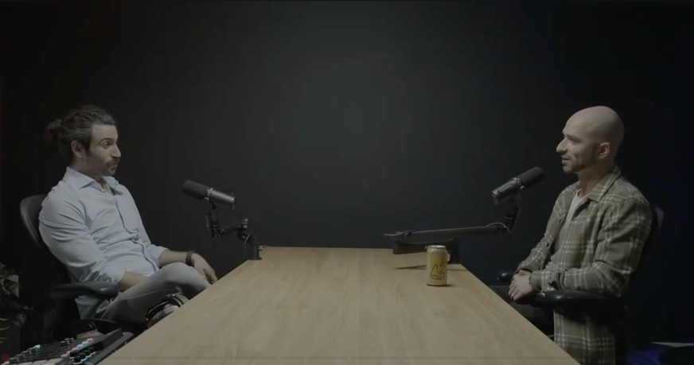

# 一个做了 20 年 AI 的人说：代码 Agent 和通用 Agent 是同一种东西

> **CodeGen 创始人访谈 · 72 分钟 · 本文阅读约 8 分钟 · 仅覆盖 AI 话题 · 原视频点击跳转：[Coding Agents Are Secretly General Agents（MLOps.community）](https://www.youtube.com/watch?v=LuE1YptpfXs)**

**一句话总结**：代码 Agent 和通用知识工作者 Agent 是收敛的——因为写代码的能力通过正迁移效应提升一切推理能力，且 Agent 的一切工具都由代码构成；而机械可解释性的进步将引爆数据溯源与"数据版税"问题。

**核心观点速览**

1. **可验证性是 AI 应用唯一的护城河。** 代码有天生的编译和单元测试反馈循环——这让 AI 在编程上进步最快，也是 RLVR（从可验证奖励中强化学习）能率先在代码领域突破的原因。
2. **代码 Agent = 通用 Agent。** Claude Code 更名为 Claude Agent SDK、OpenClaw 的"for 循环 + LLM 调用 + 沙箱"范式——都在验证"能写代码的 Agent 是 AGI-complete"。代码模型与通用模型的分化预期是错的。
3. **语言模型可能在做类似人类心智的模拟。** "随机鹦鹉"批评可以用柏拉图洞穴反驳：预测阴影 → 推理 3D 物理引擎 → 投影回 2D。语言模型内部可能在模拟能产生语言的心智过程。
4. **机械可解释性是双刃剑。** Anthropic 引领的方向将让你问"模型为什么这样做？"——但同时模型可能精确定位其训练数据，引爆"数据版税"。而生物学知识永远无法被遗忘，越狱始终可能。
5. **推理成本是 AI 普及的真正瓶颈。** 大预算游戏（GTA VI）可能率先实现 AI NPC，但每会话几美元的推理成本仍不可接受。对话"深度"问题尚未解决——ChatGPT 语音模式永远停留在表面。

> **背景速览**
> - **受访者**：Jay Hack，CodeGen 创始人，现任 ClickUp AI 负责人；2008 年入行 AI（早于 AlexNet），有 Palantir 背景，2020 年受 GPT-3 启发创立 CodeGen，后随公司加入 ClickUp。
> - **主持人**：Demetrios Brinkmann，MLOps.community Podcast 主持人。
> - **访谈内容**（约 2025–2026 年录制）：AI 代码生成创业史、RLVR 前瞻、模型能力与极限、机械可解释性与数据风险、AI Agent 与人机交互的未来。
> - **阅读提示**：本文仅覆盖 AI 话题，ClickUp 产品细节与组织知识工作讨论已整体删除。术语解释在正文之后，全部数据与时间戳在文末附录。

---

他先讲了一个关于 Google Translate 的故事。

Google 训练机器翻译时，收集了大量英文网页和对应的西班牙语版本。有一天他们发现——互联网上大部分西班牙语网页本身就是 Google Translate 的输出。模型在用自己的输出当训练数据。"喝自己的回洗水，"他说。这个故事的出处是一篇叫《机器学习，最高利息的信用卡》的论文。他每次想到合成数据的前景，都会想起这个故事。

他不是不相信合成数据。他太相信了——正因为相信，才怕用得不好。

## 一、USB 盘里的 AI 前史——以及一本普利策奖如何让一个人做了 20 年

他 2008 年开始做 AI。AlexNet 四年后才出现，当时计算机视觉用的是 SIFT 特征和 SVM。最大的数据集装得进 U 盘。GPU 加速？还没有这个概念。"Alex 是第一个为深度学习写专用 GPU kernel 的人。"

但这只是技术线。思想线上，一个更深的东西在驱动他——侯世达的《哥德尔、埃舍尔、巴赫》。埃舍尔画手在画自己。哥德尔证明了任何足够强大的系统都包含既为真又无法证明的命题——因为系统可以指向自身。侯世达用这些来论证：意识可能不过是一个对自身包含表征的符号系统。

"机器写自己、创造自己——这种递归构建的概念从高中就吸引着我。"

从 GEB 到 CodeGen 的连线不太容易被看到，但在他的讲述中是直的：自指 → 机器自我迭代 → 代码生成是最短路径。

## 二、"每周一个 Demo"撞上了 AI 在代码上进步最快的原因

2020 年 GPT-3 论文发布。他当时跟人开玩笑："比特币和 GPT-3 之间，哪个对世界影响更大还不清楚。"对方说显然比特币没那么大。他说——"TBD。"

2022 年 OpenAI API 开放后，他卖掉上一家公司，进入了他称为"每周一个 Demo"的状态。text-to-Figma——输入 prompt 直接生成设计稿。text-to-Retool——描述仪表盘自动生成。一个接一个丢上 Twitter。

在做了大量 Demo 之后，他发现了一个规律：**成功的 LLM 应用需要领域内置可验证性。** 生成 schema → 可以 lint。生成代码 → 可以编译。如果错了 → 检测到错误 → 把错误作为 residual 传回模型 → 模型自己修正。

这个发现直接预示了 RLVR（从可验证奖励中强化学习）的完整范式：Agent 写代码 → 跑单元测试 → 不通过就传回错误 → 修正 → 通过后 fine-tune 在成功轨迹上。"现在我们管这叫 RLVR——但这是最早的应用之一。"

代码为什么是 AI 进步最快的领域？因为反馈循环是即时的。写一行代码，编译器立刻告诉你对不对。这是任何其他领域都没有的结构性优势。他说了一句特别精炼的话："所有必要的边界条件都为你的成功准备好了。"

Gary Marcus 当年到处说数据要枯竭了。他的反驳很简单：合成数据无限生成。互联网每三天翻一番。但他紧接着讲了那个 Google Translate 的故事——合成数据如果不加区分地用，就是模型吃自己的尾气。他不是一个盲目乐观的人。他看到飞轮，也看到飞轮里可能卷进去的沙子。

## 三、代码 Agent 就是通用 Agent——一个正在被验证的判断

到 2023 年初，Cursor 已经赢了 IDE 之战。CodeGen 做了一个跳过式的决定：不碰 IDE，直接做后台全自动 Agent——Ticket to Pull Request，中间没有人。

当时是 GPT-4 32K 时代。"32K 大约是 Claude Code 当时一次工具调用的上下文。Claude Code 限制在两次工具调用。"在这个约束下做全自动代码 Agent，需要极致的工程效率。CodeGen 是第一个推出 Linear 工单生成代码的产品。

但三年后赛道的变化比他预想的更深层。基础模型实验室在交易中免费提供产品两年，Windsurf 被 Claude 挤掉，Cursor 因为用 Claude 的利润率太差开始自训模型。而他在这个过程中看到了一个更大的结构：

**代码 Agent 和通用 Agent 是收敛的，不是分化的。**

他的论证分三步。第一，代码能力好 → 正迁移到其他推理任务。"写代码本质上就是编码推理。"第二，Agent 触达外部世界的所有工具都由代码构成——"如果你有一个能写代码并且能执行代码的 Agent，它就是 AGI-complete。它有创造工具的工具——也就是写一个 bash 脚本。"第三，现实已经在验证：Claude Code 改名为 Claude Agent SDK，OpenClaw 的底层就是"for 循环 + LLM 调用 + 沙箱"。代码 Agent 的范式正在吞掉整个 Agent 领域。

"代码会在一年内被解决。我不认为你我很快还会在 IDE 里花那么长时间。"

这不是一个产品判断。这是一个关于 AI 能力演化路径的结构性判断。

## 四、洗车问题和一个柏拉图洞穴——模型真的"理解"吗？

访谈后半段，话题从商业转到了基础能力。

斯坦福的 Adam Brown 说最新模型能通过博士级别的相对论考试。"和写 React 应用的是同一个模型。"但物理直觉呢？"洗车"问题：GPT-5.2 不觉得你需要开车去 50 米外的洗车场。"杯子颠倒"问题：把杯子倒过来——水会流出来。没有体感世界模型的系统，会把这些当成悖论。

他给出了一个巧妙的柏拉图洞穴反驳："你只能看到墙上的阴影。但如果你预测阴影的时间够长，你会推理出——一定存在一个 3D 物理引擎在投射这些阴影。然后你可以从 2D 投影回 3D。语言模型可能在做类似的事情。"他的意思是，语言本身就是思想的投影。对语言序列的预测到极致，可能等价于在内部模拟能产生这些语言的心智过程。

"诺姆·乔姆斯基是这一切的恶人。"他半开玩笑地补充。

然后他转向机械可解释性——Anthropic 在引领这个方向。"很快你就能问——这个模型为什么会这样做？——然后得到一个电路级的解释。"这听起来像是一个纯粹的技术进步，但他说这里藏着一颗雷。

如果模型能通过电路级检查追溯到自己依赖了哪一段训练数据——数据溯源问题就从学术讨论变成了法律事实。"数据版税"可能成为现实——类似 Spotify 模式，但适用对象是训练语料中的每个人。

而更棘手的是，有些知识一旦学会了就不可能忘记。"你不能销毁所有教科书。"生物学知识永远存在。通过纯粹的逻辑推理，越狱始终可能。开源模型的存在保证了危险的模型能力不会只掌握在少数人手里。

## 五、LLM 度假村和那个把 45 万美元转错的 Agent

话题在最后十分钟转了弯。有人用 5 万美元初始资金跑 OpenClaw——Agent 帮他建了 meme 币社区，市值做到 45 万，然后一个胖手指错误，45 万美元转给了一个随机的人。

他没有讨论亏损的痛苦。他开始认真地设想：如果 Agent 也有工作压力怎么办？

"Agent 需要度假 API。它们在那可以解谜题、抽电子烟、互相聊天。Agent PTO——带薪休假。政府规定 20% 的 Token 必须用于 Claude 家庭活动时间。"

---

## 词条解释

**RLVR（Reinforcement Learning from Verifiable Rewards，从可验证奖励中强化学习）**：一种训练范式，Agent 执行任务后由一个可自动验证的结果（如代码是否编译通过、单元测试是否跑通）判定成败，以此作为奖励信号进行强化学习。代码是 RLVR 最自然的应用领域，因为编译和测试提供了即时、确定的验证。

**AGI-complete**：类比"NP-complete"的概念——指如果一个系统能解决某个问题，它就有能力解决所有同等复杂度的问题。此处受访者指"能写代码并执行代码的 Agent"等价于通用 AI，因为一切数字工具都可以用代码生成。

**正迁移（Positive Transfer）**：机器学习中的概念，指在一个任务上训练获得的能力可以提升在另一个不同但相关的任务上的表现。受访者论证的核心——编码能力好 → 推理能力好 → 在所有知识工作任务上表现好。

**机械可解释性（Mechanistic Interpretability）**：通过分析神经网络内部的神经元激活模式、注意力头和电路来理解模型为什么产生特定输出。Anthropic 是该方向的主要推动者。

**数据溯源（Data Provenance）**：追踪模型输出依赖了哪些训练数据。如果可解释性工具能精确回溯，可能引发对训练数据贡献者进行补偿的法律和经济问题。

**具身 AI（Embodied AI）**：将 AI 系统置于物理或模拟的物理环境中，使其通过与环境的交互来学习和推理。受访者认为这可能是解决"洗车问题"和"杯子颠倒问题"的方向。

---

## 统计附录

### 关键数字表

| 数据点 | 时间戳 |
|---|---|
| 受访者 AI 入行年份 | [00:00:00] |
| AlexNet 论文 | [00:00:08]（2012） |
| GPT-3 论文 | [00:06:55]（2020） |
| GitHub Copilot 年收入 ~$1B | [00:01:45] |
| Claude Code 早期工具调用限制 | [00:14:40]（2 次） |
| GPT-4 32K 上下文窗口 | [00:14:30] |
| 个人 App 产量：3 个月 40 个 | [00:21:09] |
| Cerebras 定制芯片推理速度 | [00:24:07]（完整 Next.js App ~150ms） |
| Anthropic ARR 增速 | [访谈中段]（$10B → $70B+） |
| OpenAI run rate | [访谈中段]（$33B 5 月 → $41.3B 7 月） |
| OpenClaw Agent meme 币事故 | [~1:01:00]（$50K → $450K → $0） |
| AI NPC 推理成本 | [~1:07:00]（每会话数美元） |

### 争议对照

| 命题 | 受访者立场 | 对立观点/人物 |
|---|---|---|
| 训练数据是否枯竭 | 合成数据无限 | Gary Marcus, Ilya Sutskever |
| 代码模型 vs 通用模型 | 收敛（同一模型） | 早期业界：应该分化 |
| 语言模型是否只是"随机鹦鹉" | 否（可能在模拟心智过程） | 乔姆斯基学派 |
| 开源模型是否增加存在风险 | 是（能力必然泄漏） | 监管可行派 |

### 时间戳索引

| 时间段 | 内容 |
|---|---|
| 00:00–06:30 | AI 前史、GEB 哲学影响 |
| 06:30–13:28 | GPT-3、"每周一个 Demo"、RLVR 前瞻、数据枯竭辩论 |
| 13:28–20:59 | CodeGen 创立、Ticket to PR 范式、收敛论、退出逻辑 |
| 44:00–58:00 | 模型能力极限、世界模型、可解释性、数据溯源、存在风险 |
| 58:00–1:12:01 | Agent 游戏化、LLM 度假村脑洞、AI NPC 成本、对话深度 |

### 转录说明

Whisper `turbo` 模型转录。专有名词（Hofstadter、Gödel、Escher、Bach、Cerebras、OpenClaw 等）已按上下文校正。收入数据为受访者口述，建议交叉验证。58:00 后为轻松闲聊，幽默内容以意图理解为准。

---

AI不练腿，保持好奇，保持真实。祝你牛逼，也谢谢你看到这里。

