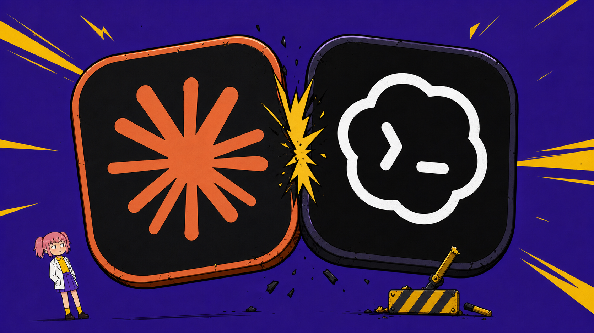
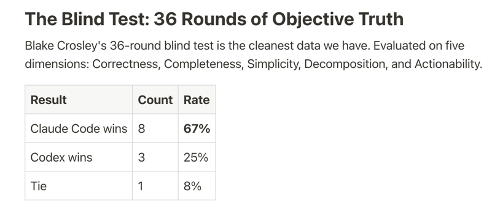
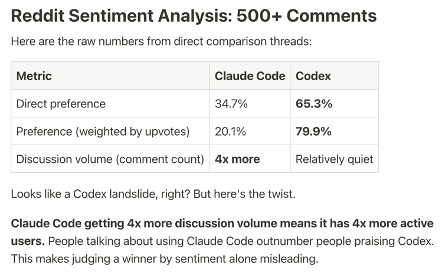
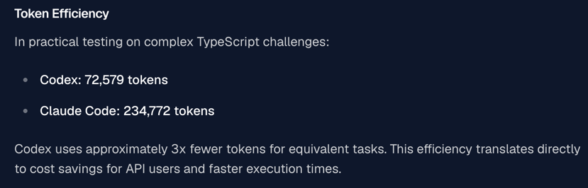
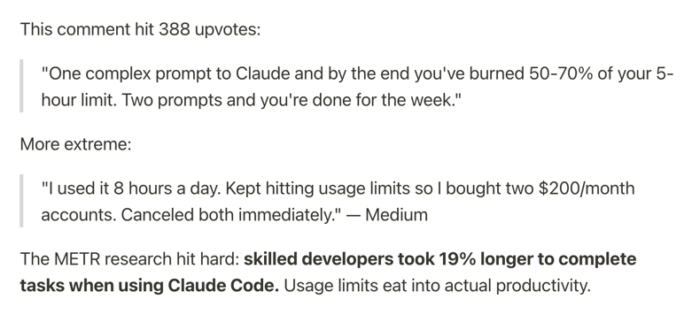
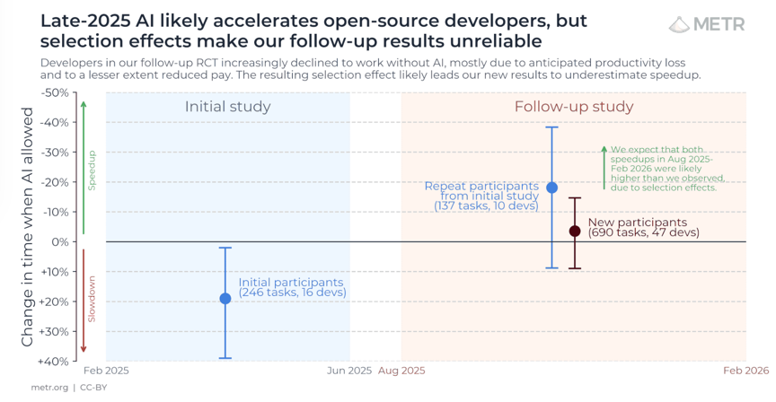
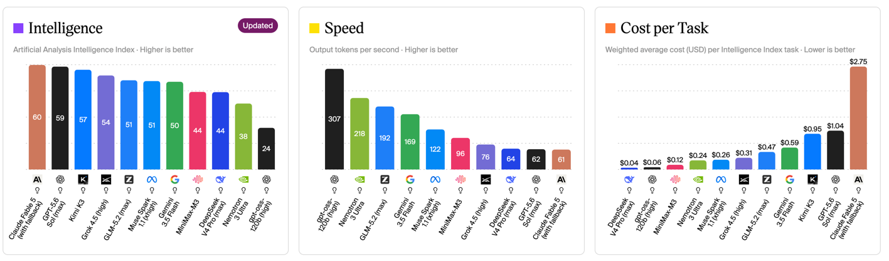
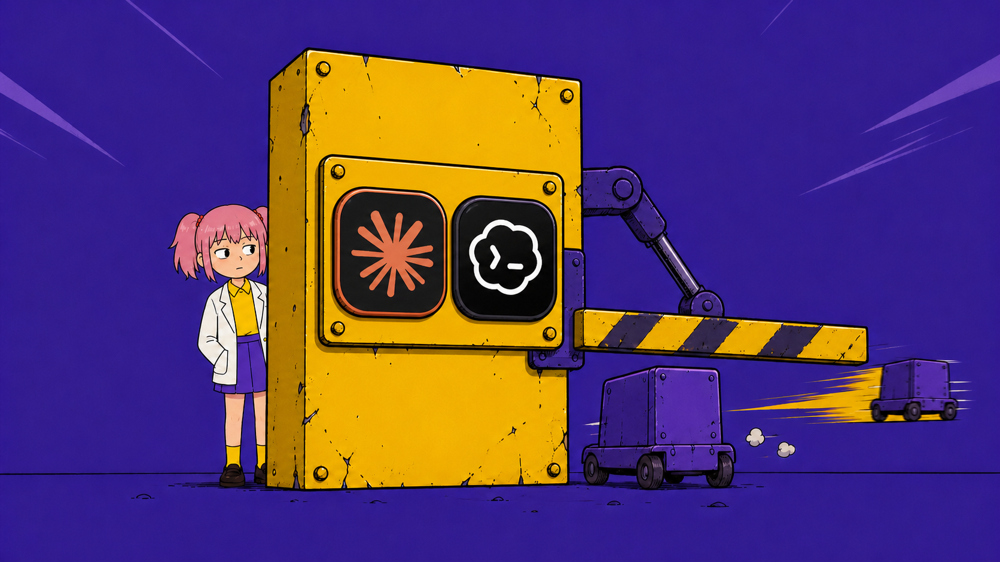

# Claude code 多问一次确认，就少一块市场

2026 年 AI 编程工具圈最撕裂的一组数据，来自 Reddit 上的一项开发者调查。

从五个维度进行评估，正确性、完整性、简单性、可分解性和可操作性。

36 轮盲测，Claude Code 赢 67%，OpenAI Codex 赢 25%。

但同一个调查问"你实际用哪个"，65.3% 的开发者说 Codex，只有 34.7% 说 Claude Code。

**产品更好，用的人更少**，我不明白。

GlobalData 2026 年 1 月的声量分析说，Claude Code 占 X 平台编程 Agent 讨论量的 75%，情感高度正面。

口碑、盲测、声量 Claude code 全赢，实装率却是惨败。

但顺着成本往下挖，能挖出一条完整因果链，起点是一个产品交互决策。

---

第一环，token 消耗。

多个第三方对比测试显示，**Codex 完成同一任务约消耗 Claude Code 三分之一到四分之一的 token。**

这个差距的根源，埋在两个产品的交互哲学。

Claude Code 的设计是"先理解再动手"，先读项目结构，确认你的意图，再执行。

Codex 的设计是"先行动再迭代"，你定义任务，它直接开干，中间更少向你确认。

每一次"你确定要的是这个吗"，都是一轮额外的上下文携带和推理开销。

确认轮数，直接换算成 token 数。

---

第二环，额度墙。

Claude Pro 每月 20 美元，提供 5 小时的使用时间窗口。

但像我这种长期使用 Claude code 的穷鬼用户，肯定都知道。听起来够用，实际不是。

一个复杂提示加大型代码库，**一次会话就可能烧掉 50% 到 70% 的额度。**

Reddit 上有开发者说，同时买两个 200 美元的 Max 账号还是会撞墙。

反观 Codex 绑在 ChatGPT Plus 里，每月 20 美元，一天正常使用，对话，开发，生成图片，基本不撞墙。

更不要提 Codex 还有个重置仙人 Tibo，最近不仅砍掉了五小时限额，还不定期掉落 Reset 礼包。

---

第三环，用户体感。

2025 年初，METR 曾做随机对照实验，在当时以 Cursor 和 Claude 3.5/3.7 Sonnet 为主的工具条件下，开发者主观认为 AI 让自己更快，实际任务时间却平均增加了19%。

这个结果不能代表今天的 Claude Code，但它至少揭示了一个问题，开发者的“提效感”与真实生产率有时候并不总是一回事。

2026年，METR也承认，随着 Agent 深度进入工作流，传统的单任务计时方法已经越来越难准确测量生产力。 

**不同的用户场景，对工具带来效率提升的感受完全不同。** 更好的模型和架构不是能帮助用户解决问题的充分条件了。

---

熟悉 SOTA 模型的朋友都知道，Claude 长期霸榜 SWE 榜单。

但其实，顶尖模型之间的差距，往往没有天差地别的，所以才有了日抛型 SOTA 模型的说法。

更不要说，榜单测评中间的水分不少。

如果大家有印象的话，2026 年最流行的 vibe coding 方案，从原教旨主义演变成了"我都要"。

**Claude Code 做架构规划和复杂重构，Codex 做快速实现和并行任务**，两个 20 美元叠加，总成本 40 美元，效率甚至优于单个 100 美元的方案。

盲测赢 67% 的 Claude code，在这一实际生产中被折算成了"混合方案里的高端组件"。

因果链到此闭环：确认轮数 → token 消耗 → 额度墙 → 用户体感 → 实装率。

---

Agent 确认深度不是一个体验变量，是一个成本变量。

它顺着 token 消耗一路传导到定价空间，再传导到市场份额。

设计 Agent 的确认策略时，"这里要不要问一句"的决策，应该用定价决策的严肃程度来对待。

多问一次确认，用户的心智负担降一点，但账单厚一点，额度墙近一点。

少问一次确认，产品更便宜、更敢用，但"过度重写"的风险高一点。

Reddit 上对 Codex 最多的抱怨恰恰是它改掉不该改的代码，2026 年 5 月 Codex 工程负责人在 X 上征求反馈，75.3% 的答复是负面的。

**没有免费的效率，也没有免费的自由。**

你的产品问几次，就值多少钱。

---

AI不练腿，保持好奇，保持真实。祝你牛逼，也谢谢你看到这里。

