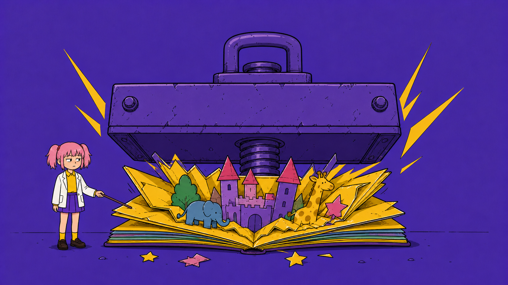
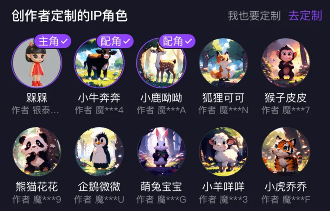
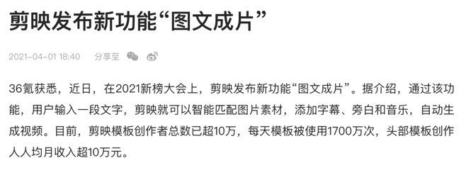
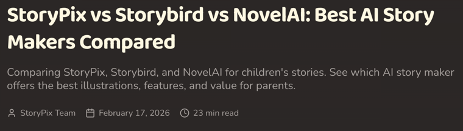
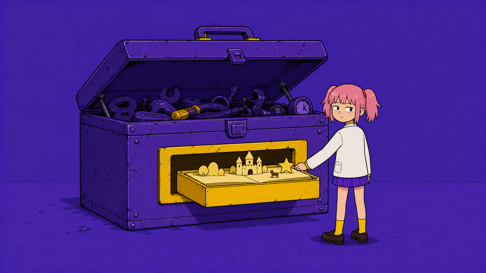

# AI 绘本为什么独立公司做不成

2023 年 7 月，ImageStory 微信小程序上线。

创始人惟忠是前阿里产品总监，创业契机是给 5 岁的女儿做一本专属绘本。

上线第二个月，用户增长 700%，达到数万用户，让无数 AI 创业者眼红。

此后三年，它没有公布任何融资信息。

2024 年 4 月 16 日，百度在 Create 2024 开发者大会上发布「智能漫画」和「智能画本」。

李彦宏亲自站台。

智能画本主打一句话主题、分钟级生成视频画本。

公测期超过 50 万人预约。

到 2025 年初，百度文库 AI 功能 MAU 超过 9000 万，AI DAU 增长 230%，付费用户超过 4000 万。

百度前副总裁，现百度 AI 战略的核心负责人王颖在公开分享中把智能画本列为文库核心高付费率 AI 功能之一。

---

ImageStory 要自己找用户，小程序分发、IP 合作，每一步都要花钱。

百度文库不需要，用户本来就来查文档，顺手做一本画本，获客成本约等于零，。

**这个差异决定了两种生意的生死。**

绘本创作是高频、低门槛、情感驱动的场景，天然适合拉动平台活跃。

大厂不需要这个功能自己赚钱，它的价值在平台会员转化里回收。

剪映更早演示了同一逻辑，2021 年 4 月上线「图文成片」，核心功能免费，价值在抖音生态回收。

独立公司没有生态可以回收价值，只能直接向用户收费。

但收费能力恰恰是这个赛道最没被验证的部分。

ImageStory 的付费率和复购率，从未披露。

整个赛道，无论国内还是海外，没有一家披露过复购数据。

海外活得还行的两家都在收高价，StoryPix 每月 19.99 到 79.99 美元，Dashtoon 的商业版定价不透明。

高价意味着小众，小众意味着长不大。

---

融资市场已经投票。

国内图文故事赛道公开可查的融资，只有柯南 AI、噗噗故事机等数百万元天使轮。

同一时期，海外的 Dashtoon 累计融资约 2500 万到 3000 万美元。

同一个赛道，海外投资人还在赌垂直工具，国内已经没人赌独立公司。

需求与用户场景本身站得住脚。

家长愿意为孩子定制绘本，这一点 ImageStory 的 700% 增长和百度 50 万预约都验证过了。

技术也不是决定性变量。

多模态模型商业化成熟，你会调用 API 你就能做套壳应用，只要有手有钱就行。

**所以问题只剩一个，获客与付费转化。**

当大厂能把功能零成本塞进 9000 万 MAU 的平台，独立公司就必须同时回答两件事，用户愿意单独付费，以及付费之后会回来。

而这两组数字，整个行业都拿不出来。

我发现这给出了一个可复用的判断方法。

评估一个 AI 功能时，如果平台加一个按钮就能覆盖它，独立创业的窗口大概率已经关闭。

**或者我能把产品迭代跑得飞快，毕竟天下武功唯快不破。**

---

AI不练腿，保持好奇，保持真实。祝你牛逼，也谢谢你看到这里。

