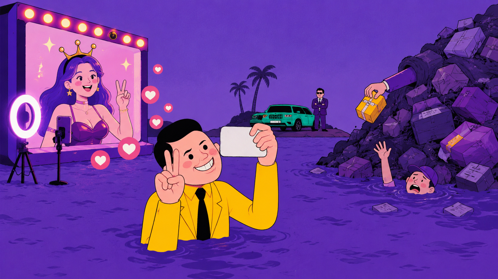
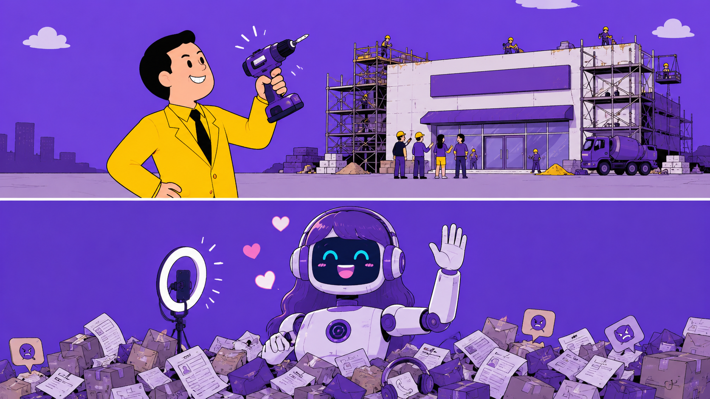
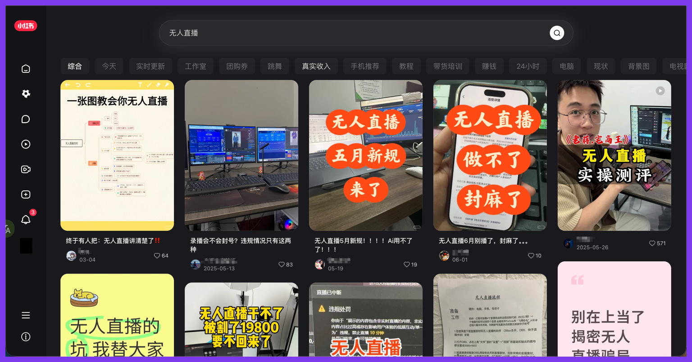
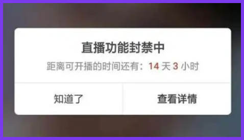
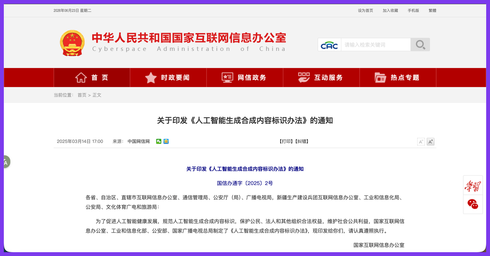
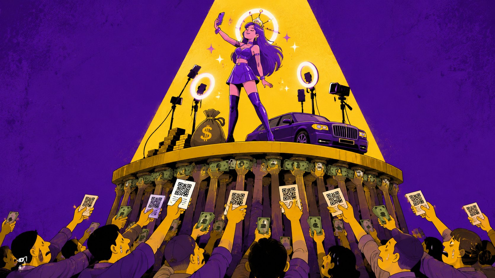

# 数字人直播：卖铲子的人已经换了路虎

618 结束那天，我朋友圈出现了 14 个"数字人直播暴富"的封面。

最离谱的一个标题是："睡觉也能赚钱"。

我点进去看了。确实能——你睡觉，他赚钱。

---

前两年，数字人直播的标准话术是：不用露脸，不用开播，不用拍摄，一套系统自动赚钱。

结果到了 2026 年 618，真正跑出数据的不是"普通人挂机暴富"，而是平台里的商家工具。

公开报道里，JoyStreamer 在 618 开场 4 小时后，数字人开播商家同比增长 6 倍，带货成交额突破 7000 万元；此前这个服务已经累计服务超 7 万个商家。

这组数据很容易让人产生一种幻觉：

机会来了。

接着第二种幻觉也来了：

是不是终于可以不用露脸、不用熬夜、不用学直播，靠一个数字人替我把钱挣了？

我们就聊一个更朴素的问题：**数字人直播现在到底能不能做？**

答案很明确：

**能做，但只适合按经营工具做，不适合按副业套利做。**

如果你是有货、有店、有账号、有运营能力的商家，数字人直播可以是低峰补播、标准化讲解、客服导购、内容复用和人机协同工具。

如果你是普通人，手里没货、没账号、没运营、没投流、没售后，只是刷到"AI 无人直播副业课"，建议先把付款码收起来。

一句话总结：

**数字人能帮商家省一点钱，不能帮普通人凭空变出生意。**

这就好比：电钻确实能打孔，但你不能买把电钻就觉得自己能开装修公司。

---

## 普通人想做，和普通人能做，不是一回事

普通人为什么会想做数字人直播？

**因为这套话术太懂焦虑了。**

- 不用露脸。
- 不用一直真人开播。
- 不用复杂拍摄。
- 好像不用囤货。
- 好像买个系统就能自己播。
- 好像别人已经靠它赚到钱了。

这套组合拳打下来，打的不是技术需求，是你的钱包和智商的双重焦虑。

尤其这几年 AI 新闻天天天塌了。今天某模型重新定义生产力，明天某应用开启新时代，后天某发布会又让人类工作方式彻底改变。你要是不赶紧找个 AI 项目上车，好像就要被时代扔到路边捡瓶子。

这时候数字人直播就显得特别亲切。

AI 写代码你不一定会，AI 做科研你也插不上手，但直播带货你听得懂。带货、佣金、成交额、副业、躺赚，这几个词排在一起，看着就像离钱包很近。

"某些人"最懂这一点。

模拟一下卖课现场：

~~~~ 

"兄弟，这个不需要你露脸。"

"嗯。"

"不需要你开播。"

"哦？"

"不需要你有货源。"

"真的？"

"那需要我有什么？"

"需要你有付款码。"

"……"

"以及，一颗相信奇迹的心。" 

~~~~

问题是，直播电商从来不是"播出来"就算赢，它是"卖出去"才算数。

工具把开播门槛打下来了，商业门槛还站在那里。

---

## 商家能用，不代表谁都能用

商家的需求就扎实得多。

他们不是突然想靠直播改变命运，他们只是想让现有生意跑得更顺一点。

数字人直播对商家最现实的价值，无非是这几件事：

- 真人主播排班贵。
- 非黄金时段没人播。
- 商品讲解重复度高。
- 客服导购问题要反复答。
- 大促期间需要快速扩充直播时长。
- 已有话术、素材、商品信息希望复用。

商家已经有货、有店、有用户、有售后、有交易链路。**数字人不是给他们凭空变出生意，而是嵌进已有生意里，帮他们干一部分重复活。**

当然，上面都是有吹牛皮的成分，实际情况也不如讲的这么理想。

即使商家安排专人三班倒的陪着 AI 直播，在 AI 开始"胡言乱语"的时候，以"迅雷不及掩耳之势"冲过去按重启键。 

商家也要做好买一批号然后被封一批号的准备，整体流程，操作起来远不像宣传的那般清爽。

这还不提投入的成本是不是真的靠长尾直播赚的回来。

商家真正想要的，不是"像真人"，而是"像员工，但别那么贵"。

问题是，便宜的员工通常干不了贵员工的活。AI 也一样。

---

## 这门生意里，先赚钱的人通常不是主播

数字人直播的商业问题，不是"技术能不能用"，而是：**谁赚钱，谁付费，谁背风险。**

最先更容易赚钱的，通常不是普通人，而是：

- 平台。
- 工具商。
- 服务商。
- 代运营。
- 代理体系。

平台想要的是更多商家开播、更多交易机会，以及更多可治理的直播供给。

服务商能卖的东西就更多了：数字人 SaaS、声音克隆、形象定制、直播间搭建、代运营、课程、代理加盟，全都能收费。**尤其当普通人相信"这是 AI 红利"以后，成交效率可能会非常可观。**

只要算得清 ROI，能降低一部分人力成本，延长一部分有效开播时间，复用一部分内容资产，对商家来说，这就是正经工具。

但对普通人来说，情况往往正好反过来。

你付了课程费、系统费、代理费、素材费，钱先出去了。后面能不能起号，能不能卖货，会不会封号，投流亏不亏，售后谁管，违规谁背，退款能不能退，这些风险会慢慢都回到你身上。

**先闭环的，往往是对方的商业模式，不一定是你的。**

---

## 真正成立的路径，不是"无人"，而是"人机分工"

### 平台路径

JoyStreamer 的 618 数据至少能说明一件事：**数字人直播在平台工具、商家货盘、交易场景、合规路径同时存在时，可以被规模化使用。**

但这个案例不能推出：

- 普通人买课就能起号。
- 没有货也能靠数字人带货。
- 无人挂机也能稳定变现。
- 换个平台就能照搬。

平台把路修好了，不代表你穿拖鞋也能跑马拉松。

### 人机协同

真正更可复制的路径，是：

- 已经有商品和店铺，不是从零起号。
- 商品讲解相对标准化。
- 平台允许并提供合规工具。
- 有真人运营负责脚本、活动、投流、复盘和异常接管。
- 数字人承担低峰时段、重复讲解、客服导购、内容复用，而不是完全替代真人。

这条路径的关键词不是"无人"，而是"分工"。

最后，不可避免的问题又回到了人与 AI 如何协同。

* AI 负责重复，真人负责判断和异常情况处理。
* AI 负责延长在线时间，真人负责信任和兜底。
* AI 负责把已有内容资产复用起来，真人负责选品、价格、活动和售后。

**所以真正能跑通的，不是把真人拿掉，而是把真人用在更值钱的地方。**

### 白日做梦

相反，最危险的路径就是：普通人买系统、买代理、买躺赚叙事。

新华网 2025 年报道过多起数字人直播服务纠纷：加盟或购买系统后频繁被封禁，产品效果与演示差距大，使用几十分钟即被平台封禁，后续还有声音克隆、云存储、技术服务费等隐形收费，维权困难，退款周期长。

说狠一点，有些人以为自己买的是铲子，最后发现自己买的是挖坑教程。

铲子至少还能挖土。教程只能教你：坑就是这么深，跳吧。

---

## 平台不是反对数字人，平台是反对你乱来

我去年问过"某播"产品的销售："这会不会封号？"

他说："不会，我们客户都在播。"

我又问："那如果封了呢？"

他说："那是你操作不当。"

我再问："怎么算操作不当？"

他说："就是被封了的那种。"  

数字人直播真正的边界，不是"能不能播"，而是四件事：

- 政策。
- 平台规则。
- 用户信任。
- 经营能力。

### 先看政策

2025 年《人工智能生成合成内容标识办法》明确，AI 生成合成内容包括文本、图片、音频、视频、虚拟场景等，需要添加显式标识和隐式标识。

2026 年 2 月起施行的《直播电商监督管理办法》，进一步把数字人主播等人工智能生成内容纳入直播电商监管，要求使用人工智能生成的人物图像、视频从事直播电商活动时进行标识，并持续向消费者提示。

2026 年 4 月，网信部门已经对"剪映""猫箱""即梦AI"等未有效落实标识要求的平台采取约谈、责令改正、警告等措施。

重点不是"记得打个标签"。

**重点是：以前很多人把 AI 标识当礼貌，现在它越来越像义务。**

### 再看平台

不同平台对数字人直播的态度并不一致。

- 有的平台鼓励真人直播，把虚拟数字人代播、非真实直播列入限制或违规范围。
- 有的平台允许适当使用虚拟人，但要求显著标识、形象注册、真人实名、真人驱动实时互动，不允许完全由 AI 驱动互动。
- 有的平台把数字人做成商家经营工具，但这通常意味着它更适合平台内商家，而不是外部买个系统到处乱跑。

所以问题不是"平台支不支持数字人"。

真正的问题是：你在哪个平台播，用什么工具播，有没有标识，有没有真人介入，有没有真实互动，有没有平台认可的合规路径。

平台不是反对数字人，平台是反对你乱来。

### 再看用户信任

AI 可以提高讲解效率，也可以承担重复问答。

**但问题是，信任这玩意儿，AI 自动生成不了。**

毕竟，真到了需要“赔礼道歉”的时候，还得你这个真人上才行。

### 最后看能力

现在平台型数字人已经开始覆盖内容策划、商品讲解、实时互动、主动促单等流程。但"能互动"不等于"能独立经营"。

相信未来有一天，马斯克戴着脑机接口飞上火星，遍地都是可以翻跟头的机器人，数字人真的能帮你实现人在家中做，直播天上飞的梦想。

但那个时候，和咱们这种人更没有关系了，谁有供应链谁就能吃掉整个牌桌的筹码。

---

## 总结

所以数字人直播能不能做？

能。

但只能按经营工具做，不能按副业套利做。

如果你是商家，它可以是低峰补播、标准化讲解、客服导购、内容复用和人机协同工具。

如果你是普通人，手里没有货，没有账号，没有直播运营经验，只是被"不露脸、低成本、自动赚钱"的叙事打动，那结论也很简单：

**别一听到"无人直播"，就以为自己终于可以躺着赚钱。很多时候，躺着的是想象，交钱的是你。**

如果你是 AI 产品经理或创业者，真正值得研究的不是"数字人像不像真人"。

而是：AI 能不能持续支撑一个真实垂直场景，并且让用户愿意持续付费。

**数字人直播不是骗局。**

**但"普通人靠它躺赚"这个叙事，大概率是把你的焦虑包装成别人的产品。**

别把 AI 当财神。

更别把自己做成 AI 产业链里的耗材。

毕竟，数字人永远热情，永远正确，永远不负责。

而你，得为自己负责。

谢谢你看完这篇文章，意见仅供参考。

架构：AI不练腿
生成：GPT-5.5
优化：Kimi K2.7
审校：AI不练腿
插图设计：GPT-5.5
资料配图：公开网络

## 关键来源索引

1. 国家互联网信息办公室：《关于印发〈人工智能生成合成内容标识办法〉的通知》，2025-03-14
   https://www.cac.gov.cn/2025-03/14/c_1743654684782215.htm

2. 中国网信网：《直播电商监督管理办法》，2026-01-07；该办法自 2026-02-01 起施行
   https://www.cac.gov.cn/2026-01/07/c_1769516655383334.htm

3. 新华网：《数字人主播将被纳入直播电商监管》，2026-01-07
   https://www.news.cn/legal/20260107/5c7162053c9c40d39819c39dabb618e0/c.html

4. 中国网信网：《网信部门依法查处"剪映"App等生成合成内容标识违法问题网站平台》，2026-04-28
   https://www.cac.gov.cn/2026-04/28/c_1779119736411711.htm

5. 21 世纪经济报道：《AI接管直播间，618直播电商走向多极化》，2026-06-18
   https://m.21jingji.com/article/20260618/66ebf63a2a0b7ee2f54d923184d21f3d.html

6. 新华网 / 经济参考报：《AI深度介入"618" 电商平台竞争逻辑升级》，2026-06-01
   https://www.news.cn/tech/20260601/b11eb51e7e7f4e239b11730dc7571f20/c.html

7. 新华网：《"数字人直播"能躺着赚钱？》，2025-02-17
   https://www.xinhuanet.com/tech/20250217/585feb2c94ad4ab9a1d0805a0f4f6113/c.html

8. 新京报 / 新浪财经转载：《AI数字人主播频频被禁播，商家向运营公司索赔获部分支持》，2025-11-12
   https://finance.sina.com.cn/jjxw/2025-11-12/doc-infxefew4667366.shtml

9. 上观新闻：《严打虚拟主播？腾讯视频号拟限制数字人带货：鼓励真人直播》，2024-06-17
   https://web.shobserver.com/wx/detail.do?id=761992

10. 抖音规则中心：《抖音关于人工智能生成内容标识的水印与元数据规范》
    https://www.douyin.com/rule/billboard?id=1242800000050

11. 抖音规则中心：《关于不当利用AI生成虚拟人物的治理公告》，2024-03-27
    https://www.douyin.com/rule/billboard?id=1242800000102

12. 中国律师网：《虚拟数字人直播的合规风险及应对之策》，2026-05
    https://www.acla.org.cn/info/8918ecc303f94de5ba1cb77b97eae856
